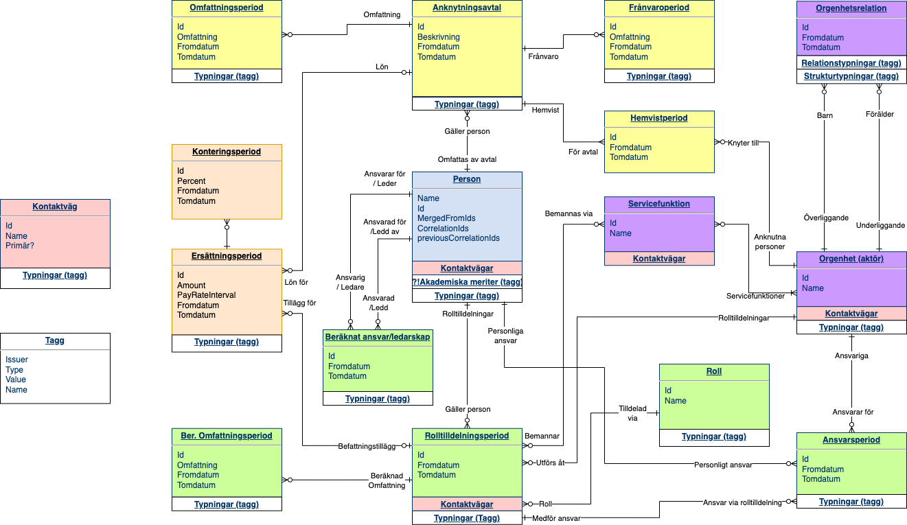

# TOP - Transfer of Organizations and Persons


BETAVERSION 3, 2024-06-10


Detta dokument delas upp kapitelvis enligt följande:

[[_TOC_]]

# 1. Bakgrund och avgränsningar

Inom ATI-gruppen under samarbetsorganet ITCF finns en arbetsgrupp vars mål är att ta fram en sektorstandard för att överföra information om personal (löst definierat som "allt som inte platsar i LIS") mellan IT-system. Standarden blir en kompanjon till LIS som används för studentrelaterad information.

## 1.1 Målbild

Arbetet inleddes med att se hur vi kunde använda HROpen. Den standarden visade sig dock sakna viktiga möjligheter för bland annat internationalisering och att samma person har flera roller i olika delar av organisationen, och genom att inte direkt stödja våra usecase blev många konstruktioner repetitiva eller ointuitiva. TOP använder alla delar av HROpen som går, men utökar och stuvar om. Se TOP som en dansgolvsremix av HROpen snarare än en cover.

Vi har utgått från två huvudsakliga tänkta use-case: att ett lärosäte får ut sin HR-data från en HR-applikationsleverantör i ett applikationsoberoende format, och att lärosätet skickar data i samma format till en tjänsteleverantör, där vi som exempel valt Retendo. Vi har inte som uttryckligt use-case att lärosäten använder TOP internt, men gör samtidigt standarden avsiktligt dynamisk så att det är möjligt att göra i många olika arkitekturer om man vill det.

## 1.2 Exempel: Lilla Lärosätet

I hela standarden används ett och samma exempel. Här beskrivs detta, och eftersom informationsmodellens begrepp definieras först i nästa kapitel kommer beskrivningen här att vara lite vag för den som återvänder efter att ha tagit till sig hela standarden. Varje del av nedanstående exempel är relevant för någon del av standarden.

> _Lilla Lärosätet_ (LL) är ett ofattbart litet lärosäte. Personalen består av fyra personer, och de har två studenter. Organisationen består av en institution (Institutionen för Småskalighet) som är uppdelad en enda avdelning (Avdelningen för Smått Tänkande). Avdelningen har en professor, Patrik Socrates (men, som Patrik själv säger "det är bara min mamma som kallar mig Patrik, alla andra har i hela mitt liv kallat mig Putte.") Under Putte på avdelningen finns en lektor, Lena Lund. Man har också en administratör anställd på institutionen, han heter Adam Nistram. Han är egentligen heltidsanställd, men är föräldraledig på 40%.
>
> Givetvis har man en rektor, hon heter Hedda Master. Institutionen har en prefekt, förtroendevald på 5 år, och i ett hårt val blev det professor Putte som fick den posten. Han är därmed, enligt linjeorganisationen, chef över sig själv.
>
>Lilla Lärosätet har valt att organisera sina program i en matrisstruktur. Lena Lund fungerar som programansvarig för deras enda program, Kandidatprogram i Långsiktig Småskalighet, och programmet får en del av lärosätets pengar till sin budget. Denna budgetdel överför de till institutionen då de ger kurser som programmet vill ha.
>
>Två studenter läser på Lilla Lärosätet, Emil Studat och Emilia Fodat. Som avlastning vid tentamensrättning har avdelningen valt att anställa Emilia Fodat på timmar.
>
>Men Lilla Lärosätet har ambitioner. De har startat ett stort övergripande projekt som de kallar "Måttade Medelmedel" där de undersöker vilka medel som skulle behövas för att bli medelstora. Där har de hyrt in en projektledare, Linda Projektil, från ett konsultbolag på heltid under första halvåret 2023, och en projektdeltagare Peroja Deltacko som skall göra enstaka timmar med utredningsuppdrag.
> 
> Lilla Lärosätet har en integration till en extern applikation, ett passersystem, där alla med ett "anställningsliknande förhållande" till institutionen skall få behörighet att komma in i skalskyddet.

# 2. Informationsmodell / abstrakt datamodell

För att överföra information måste avsändare och mottagare vara överens om hur informationen är modellerad och strukturerad. Detta kapitel beskriver de olika begrepp som används och hur dessa skall förstås i lärosäteskontext. Tillsammans med schemat visar detta entydigt hur man kodar och avkodar data, och vad den betyder.

Den grundläggande datamodellen går att använda både för data i vila och för data under färd. 

Vissa entiteter i standarden är dock mest relevanta för data under färd. Ett exempel är modellen som beskriver vem som är någons chef. Rådatat till den är både chefskap och ett komplett organisatoriskt träd, tillsammans med en lokal regeluppsättning för att lösa upp sådant som att prefekter ibland skulle bli chefer över sig själva eller hur man prioriterar när någon har flera parallella anställningar.

För att en mottagare varken skall behöva känna till reglerna eller ha ett komplett organisationsträd så kan man överföra färdigberäknade relationer mellan personer, t.ex. att Hedda är chef över Putte.

## 2.1 Begrepp och modeller

### 2.1.1 Rundvandring / överblick

I huvudsak kan TOP beskrivas som ett sätt att formera information om ett lärosätes organisatoriska struktur, vilka personer som är verksamma vid lärosätet, hur personerna verkar, vilka egenskaper som kan förknippas med organisation, personer och verksamhet, samt hur allt detta varierar över tid.

Vi börjar överblicken i begreppet **organisatorisk enhet** (nedan förkortat orgenhet), som är någon form av gruppering som är viktig för hur lärosätet organiserar en viss aspekt av sitt arbete. De flesta lärosäten har "institutioner", många har "fakulteter", som bägge är exempel på typer av orgenheter i linjen. 

> Lilla Lärosätet väljer att ha orgenheterna 
> * Lärosätet (typ "Lärosäte", taggar "Resultatenhet" och "Linjeorganisation")
> * Institutionen för Småskalighet (typ "Institution", taggar "Resultatenhet" och "Linjeorganisation")
> * Avdelningen för Smått Tänkande (typ "Avdelning", taggar "Resultatenhet" och "Linjeorganisation")
> * Kandidatprogrammet i Långsiktig Småskalighet (typ "Program", taggat "Matrisorganisation")
> * Måttade Medelmedel (typ "Projekt", taggat "Resultatenhet") 

Orgenheterna struktureras med en eller flera typer av **orgenhetsrelationer**. Dessa är typade, och den vanligaste typen är de relationer som tillsammans formar linjeträdet. Många lärosäten har andra relationstyper och andra trädstrukturer parallellt med linjeträdet. Man kan t.ex. ha ett matristräd och ett separat träd som visas ut på hemsidan.

> Lilla Lärosätet väljer att ha ett linjeträd, och att sedan hålla ordning på att projektet "hör till" Lärosätet och programmet "hör till" institutionen. De behöver alltså ha två olika typer av orgenhetsrelationer - "linjeträdet" och "hör till"-relationen.
> * Två orgenhetrelationer av typ "Linjeträd" bildar linjeträdet: den ena säger att "Lärosätet" ligger över "Institutionen för Småskalighet", den andra säger att "Institutionen för Småskalighet" ligger över "Avdelningen för Smått Tänkande".
> * Två ytterligare relationer av typ "Hör till" knyter in de andra orgenheterna - en placerar projektet under Lärosätet, den andra placerar programmet under institutionen.

Orgenhetsrelationerna representerar _varje enskild_ relation i en eller flera strukturer, alltså varje kant i en organisationskarta. Men ett mycket vanligt behov för en mottagare är att kunna hitta relevant data - ofta t.ex. "alla som hör till Institution X eller någon orgenhet under den i linjeträdet". För det urvalet krävs att man har samtliga orgenheter och orgenhetsrelationer lokalt, vilket vi inte vill kräva av en mottagare. Därför har vi också begreppet **filtreringsrelation**, där man överför färdiga listor över andra orgenheter som är relevanta för filtrering.

> Eftersom Miniatyrmänniskan skall erbjuda inloggning baserat på att personer har ett visst förhållande till institutionen eller någon orgenhet därunder i linjeträdet, så väljer Lilla Lärosätet att överföra en filtreringsrelation som de kallar "Delträd i linjen". Avdelningen är "en del av" Institutionen och "en del av" Lärosätet, vilket syns genom att bägge dessa ligger med i filtreringsrelationerna för Avdelningen. I Lilla Lärosätets egna system finns bara orgenhetsrelationerna, men man räknar ut de här filtreringsrelationerna när man skickar iväg data.

Orgenheterna kan inte av sig själva utföra nytta, för detta behövs **personer** - individer av kött och blod. Vi försöker att representera både personens egenskaper, hur de hänger fast i lärosätet och vad de förväntas utföra för nytta. 

> Lilla Lärosätet har såklart personposter för alla sina anställda: Hedda Master, Patrik Socrates, Lena Lund och Adam Nistram. Men eftersom både Linda Projektil, Peroja Deltacko och Emilia Fodat utför nytta åt lärosätet finns personposter även för dem.

Personer knyts till lärosätet genom **anknytningsavtal**, där den vanligaste varianten är ett anställningsavtal. Men även gästprofessurer, deltagande i forskningsprojekt, till och med när en professor muntligen bjuder in någon från Harvard att sprida stjärnglans över sin institution är former av sådana avtal.

> Lilla Lärosätet har anknytningsavtal för alla personer, men av olika typ. Hedda Master, Patrik Socrates, Lena Lund och Adam Nistram har alla typen "Anställd" på sina anknyntningsavtal. Eftersom Linda Projektil verkar vid lärosätet på heltid, så får hennes avtal typen "Bemanningspersonal". Peroja Deltacko som bara gör enstaka timmar får typen "Timkonsult", och Emilia Fodat får typen "Intermittent anställd" på sina respektive avtal.

Ett anknytningsavtal kan under sin löptid innefatta många olika egenskaper. Under en 25 år lång anställning (som är _ett_ avtal) kommer en person att byta lön, organisatorisk hemvist, tjänsteomfattning med mera massor av gånger. Varje sådan egenskap representeras därför av ett eller flera intervall eller _perioder_ av något slag - en egenskap med start- och eventuellt slutdatum.

Anknytningsavtalet kan ha ingen, en eller flera **ersättningsperioder** (en anställd kan t.ex. under en viss period få en viss lön), **frånvaroperioder** (t.ex. semester, sjukskrivning eller VAB), **omfattningsperioder** (t.ex. 80% tjänstgöringsgrad), **hemvistperioder** (som pekar ut den orgenhet där personens chef normalt sett återfinns).

> På Lilla Lärosätet finns en ersättningsperiod vardera för de fyra anställda, med typen "Månadslön" - en summa och enheten "per månad". Emilia Fodat har en ersättningsperiod av typen "Timlön" med en summa och "per arbetad timme". Vilken ersättning man ger till konsulterna bedömer man inte att någon behöver veta, så dem utelämnar man ersättningsperioder för.
> 
> De fast anställda har varsinn omfattningsperiod på 100%. Adam som är föräldraledig har utöver sin omfattning på 100%, också en frånvaroperiod på 40% av typen "Föräldraledig". Linda Projektil har en omfattningsperiod på 100%, där man också noterat att den slutar siste juni när projektet skall vara klart. Varken Peroja eller Emilia har några omfattningsperioder eftersom man inte i förväg vet exakt hur mycket de skall arbeta.
> 
> Hedda Master har en hemvistperiod som pekar ut att hon organisatoriskt hör hemma på orgenheten "Lärosätet". Patrik Socrates och Adam Nistram hör hemma på institutionen och har hemvistperioder som pekar dit. Lena Lund har sin hemvist på avdelningen. Både Linda Projektil och Peroja Deltacko har projektet som orghemvist, medan Emilia Fodat har sin hemvist på institutionen.

Ett anknytningsavtal säger _hur_ personen knutits till lärosätet, men inte _vad_ personen gör där. Det är vanligt att ha en enda anställning men vara verksam på flera olika orgenheter. Både i flera olika forskningsprojekt, deltagande i centran, men även sådant som att ekonomer kan vara anställda på Ekonomiavdelningen men verka på varsinn institution.

En uppsättning arbetsuppgifter, befogenheter, förväntade beteenden, ansvar osv beskrivs av en **roll** (jämför med rollen "Hamlet" i pjäsen med samma namn). Exempel på är roller, t.ex. "rektor", "systemutvecklare" eller "registeransvarig", men lärosätena är fria att räkna nästan vad som helst som en roll. Andra, ofta aningen tvetydiga, begrepp som "titel" eller "befattning" används i delvis liknande betydelse, men de har ofta andra innebörder också. 

> På Lilla Lärosätet har man identifierat rollerna "Rektor", "Prefekt", "Professor", "Lektor", "Projektledare", "Projektdeltagare", "Administratör" och "Amanuens".

Att en person tilldelats en viss roll på en viss orgenhet under viss period uttrycks som en **rolltilldelning**. En sådan _kan_ förnkippas med ersättningsperioder (t.ex. lönetillägg för prefekter) och omfattningsperioder (som kan vara den faktiska tid en person förväntas lägga, borträknat ledigheter med mera).

> På Lilla Lärosätet har bland annat Hedda Master en rolltilldelning med rollen "Rektor" för orgenheten "Lärosätet", och Putte Socrates har två rolltilldelningar - dels en som "Professor" för Avdelningen och dels en som "Prefekt" för Institutionen. Han tycker att det är mycket viktigare att vara prefekt än professor, och vill att prefektrollen alltid visas först, så den är flaggad som primär.
> 
> Puttes rolltilldelning som prefekt har ett slutdatum (eftersom prefektskapet är tidsbegränsat), och det är förknippat med en ersättningsperiod av typen "Lönetillägg per månad" eftersom han får extra betalt för ansvaret.
> 
> De övriga har rolltilldelningar så som man kan förvänta sig.

Lärosätena tilldelar personer vissa ansvar för vissa orgenheter. Till exempel kan en person få linjechefsansvar, ekonomiskt ansvar eller arbetsmiljöansvar för en viss orgenhet. Detta uttrycks som **ansvarsperioder**, och dessa kan antingen peka ut en någon som personligen ansvarig, eller peka ut en rolltilldelning som innebär vissa ansvar. Linjechefsansvaret för en orgenhet tilldelas t.ex. oftast genom att rolltilldelningen som Enhetschef.

> På Lilla Lärosätet har Hedda ett personligt förordnande som Rektor, vilket ger henne både ekonomiskt och arbetsledande ansvar för orgenhet Lärosätet. Putte får via sin rolltilldelning som Prefekt bägge ansvaren för Institutionen. Han har också via rolltilldelningen som Professor dessa ansvar för Avdelningen. Linda Projektil har ett arbetsledande ansvar för Projektet via sin rolltilldelning som Projektledare, men Hedda Master håller i pengarna och har det ekonomiska ansvaret där.
> 
> Eftersom man inte _måste_ peka ut ansvar överallt i sina överföringar, så väljer Lilla Lärosätet att inte tala om vem som har vilket ansvar för Programmet.

Utöver att utförd nytta struktureras baserat på roller, så kan orgenheter också ha **servicefunktioner**, där den vanligaste kanske är en expedition eller en helpdesk. De bemannas via rolltilldelningar, men har t.ex. öppettider och besöksadresser som egna egenskaper. 

> Institutionen på Lilla Lärosätet har en expedition, vilket de representerar som en servicefunktion som "hör till" alla tre linjeorganisationerna.

Både för personer, rolltilldelningsperioder, orgenheter och servicefunktioner kan man definiera **kontaktvägar**, till exempel epostadresser, telefonnummer, eller besöksadresser med eller utan öppettider.

> Hedda Master har för sin rolltilldelning som Rektor en epostadress "rektor@lillalarosatet.se", och för sig själv som individ "hedda.master@lillalarosatet.se". Expeditionen har en epostadress "info@lillalarosatet", och en besöksdisk som ligger på huvudadressen i ett rum utan rumsnummer i källaren bakom en skylt "Varning för tigern". Den är öppen 9-11 på onsdagar. All denna information överför de i en kontakväg av typen "besöksadress".

Nästan alla dessa begrepp går att typa eller märka med **taggningar**. En taggning förknippar något objekt med en viss tag under viss period. Till exempel kan man utifrån intern logik avgöra vilka personer som via rolltilldelningar just nu skall betraktas som "teknisk och administrativ personal" eller "anställningsliknande personer", och överföra en sådan taggning på dem. Då behöver mottagaren inte känna till hur varje lärosäte avgör dessa egenskaper (för inget lärosäte gör som något annat), och behöver inte heller spara komplett data för att kunna räkna ut det.

> Lilla Lärosätet har valt att tagga anställningsperioderna för Hedda, Putte och Lena med "Anställningsliknande avtal". De har valt samma taggning för Linda Projektil, trots att hon formellt är anställd av konsultbolaget. Övriga har inte fått den taggningen. Denna taggning överförs till Miniatyrmänniskan, som skall ge behörighet baserat på den.
> 
> Eftersom Hedda, Putte, Lena och Linda alla har minst ett nutida anställningsavtal som är taggat med "Anställningsliknande avtal", så väljer Lilla Lärosätet också att tagga deras fyra personposter med "Anställningsliknande person". Även om de använt anställningsavtalen för att räkna ut detta, så väljer de att överföra det som en explicit taggning på personerna, så att mottagarna inte behöver veta vilka egenskaper som gör att en person räknas som "anställningsliknande". 

Som man märker är det en väldig massa perioder överallt. Det finns tre olika fält som används. Det första är giltighetsstatus, med värdena dåtida/nutida/framtida (past/present/future). Sen kan man detaljera med start- och slutdatum om man känner till dem och mottagaren har nytta av dem.

> På Lilla Lärosätet väljer man att överföra start- och slutdatum på både anknytningsavtal och hemvistperioder via integrationen till passersystemet. De beräknade behörigheterna där kan då få korrekta start- och slutdatum vilket gör det lätt att i passersystemet se när en beräknad behörighet kommer att ta slut. 

Eftersom man kan överföra dåtida perioder, så skulle "en persons löneperioder" kunna betyda "alla sen 1980-talet" för de som arbetat länge. Det är sällan användbart. Vi pratar istället om **aktuella perioder**. Det finns inget som hindrar att man överför _alla_ objekt, men det normala är att man överför de _aktuella_, och då använder man följande definitioner:
* De nutida objekten räknas alltid som aktuella.
* _Om_ man överför framtida objekt räknas även de som aktuella (givetvis märkta som framtida).
* _Om_ man överför dåtida objekt så räknas de som aktuella under 60 dagar från den dag de blev dåtida, med syfte att mottagare skall hinna reagera på att objekt byter från "nutida" till "dåtida".

### 2.1.2 Hantering av ID:n

#### 2.1.2.1 Olika ID:n

Ett ID i denna standard består alltid av tre eller fyra delar: alltid namnrymd, datatyp och värde. Om värdet inte är globalt unikt kan man också ge ett scope, eller värderymd, för värdet.

Datatyper med namn som "personnummer" finns på många ställen, men har ibland olika definition - Primula har t.ex. ett ID som de kallar "personnummer" och som i de flesta fall är ett unikt värde utgivet av svenska staten. Men Primula tillåter att man lägger in rena hittepåvärden (t.ex. "19121212KK88") i personnummerfältet, och då är just det värdet inte längre unikt mellan olika Primula-instanser (och inte längre ett personnummer enligt svenska statens definition). 

Vi måste skilja på dessa två olika saker som bägge kallas "personnummer". Det gör vi genom att ge en namnrymd för typen - är det "personnummer enligt svenska statens definition" eller är det "personnummer sådana Primula hanterar dem".

#### 2.1.2.2 Identifikation av namnrymd

Namnrymden anges normalt sett genom ett domännamn som identifierar den definierande entiteten, t.ex. "chalmers.se" eller "orcid.org". I resten av denna standard skrivs exempel-ID:n som t.ex. `chalmers.se:person-id:123123123`, men i överföringen är dessa strukturerade som tre attribut i ett objekt `{schemeAgencyId: "chalmers.se", schemeId: "person-id", value: "123123123"}` (se 3.1.1 för detaljer).

Syftet med att använda domännamn är att det redan finns ett register för dem, så denna standard behöver inte definiera en registerhantering. Dock finns några väldigt allmäna begrepp, t.ex. svenskt personnummer, där det kan upplevas som lite krystat att sätta domännamnet - det är formellt svenska staten som delar ut personnummer, även om det är Skatteverket som managerar det. För några sådana begrepp finns en defintion med utgivare i sektion 5.1.1. 

Om ett värde inte är globalt unikt och det finns anledning att tro att en mottagare kan få sådana värden från olika ställen, så rekommenderas att den som garanterar värdets korrekthet sätter en värderymd. Till exempel finns Primulas fält "APersonId", där samma ID kan återanvändas i olika Primulainstanser, men då representera olika personer. Där skulle man då sätta en värderymd som tillräckligt unikt definierar den instans där värdet hämtats, vilket vi i text skriver t.ex. `evry.se:APersonId:1234(chalmers.se)`. I överföringen är värderymden ett extra attribut i objektet.

#### 2.1.2.3 De olika ID-fälten och hur de hanteras

En avsändare fyller i ett attribut `id` med den mest stabila identifierare man känner till för det objekt som överförs. Det skall vara en identifierare som ändras så sällan som möjligt. Syftet är att mottagare enkelt skall upptäcka att de får ny data för ett objekt de tidigare fått från samma avsändare. Därför är personnummer inte ett bra sånt här id om det går att undvika - alla har inte ett, vissa personer har flera, och många byter personnummer under en livstid. För många kommer det t.ex. att vara ett post-id i en lokal masterdatabas. 

För att erbjuda möjlighet för mottagaren att upptäcka att man får samma objekt från flera olika avsändare så kan avsändaren skicka över `correlationIds`, som är en lista av andra ID:n som man råkar känna till. På en person kan detta t.ex. vara personnummer, temporärpersonnummer från Ladok, Ladok-UID eller ORCID

Man kan inte räkna med att en viss typ av ID alltid kommer som antingen huvud-id eller korrelationsid. En avsändare som inte har något annat än personnummer använder det som huvud-id, men en avsändare som har ett annat mer stabilt id använder istället personnummer som korrelationsid.

Avsändaren kan tvingas byta ID på ett objekt. För huvud-ID:n sker det oftast när man av misstag fått dublettposter som måste slås samman, för korrelations-ID:n sker det t.ex. när någon leverantör uppströms behövt göra samma sak, eller när en person byter personnummer. Vid ID-byten överförs det gamla ID:t i `mergedFromId` eller `previousCorrelationIds`. 

Ett personnummerbyte representeras t.ex. från en avsändare som skickar det som korrelationsid genom att det nya personnumret läggs i `correlationIds` medan det gamla personnumret under en tid överförs i `previousCorrelationIds`.

### 2.1.3 Hantering av taggar

En tag är likt ett ID, men kan dessutom ha ett språkhanterat namn för mänsklig konsumtion. I standarden används konstruktionen på många ställen, både för att ange typer och för att göra allmäna taggningar. Där många standarder kanske hade valt en enum (utan möjlighet till beskrivande text), så väljer denna standard i allmänhet en tag och definierar en standarduppsättning.

Precis som ID:n används en utgivare, en datatyp och ett värde (med frivillig språkhanterad benämning). De taggar som definieras i denna standard har "*" som utgivare. Övriga har ett domännamn som identifierar utgivaren. Taggar skrivs i löptext som `<namnrymd>:<typ>:<värde>(<svensk text>/<engelsk text>)` men kodas egentligen som objekt i överföringen (se 3.1.2) där man också kan överföra fler språk än svenska och engelska om det behövs.

Tillexempel definierar standarden en tag som i löptext skrivs `*:remuneration_type:monthly_salary` (Månadslön). Den överförs som ett objekt precis som id:n.

### 2.1.4 Språkhanterad text

På många ställen är det relevant att ha språkhanterad text, t.ex. namn på orgenheter, benämningar på taggar och rollnamn. Standarden definierar hur man överför dessa, nämligen som en uppsättning par av språkkod och text. Det går att ange hur många språk som helst, men de flesta kommer att vara på svenska (sv) och engelska (en). Avsändare som har mängder av språk för något användningsfall uppmuntras att bara överföra de som mottagaren kan förväntas vilja ha för att hålla datamängderna nere. 

Det är _inte_ ett egensyfte att översätta alla taggar till så många språk som möjligt, ens om man hittar en ordbok på nätet som man kan läsa in...  

### 2.1.5 Egna utökningar

Alla avsändare är fria att göra helt egna utökningar av alla entiteter. Sådana utökningar måste vara objekt under en nyckel som är ett domännamn som identifierar den som definierat utökningen, i ett objekt under nyckeln `extensions` i det objekt som utökas:

```json5
{
  person: {
    extensions: {
      "chalmers.se": {
        "chalmers coola utökning": "It rocks!"
      }
    }
  }
}
```

Det är tillåtet att skicka vidare utökningar som någon annan definierat, om man som avsändare vet vad de betyder och vad de innehåller. Avsändare uppmuntras dock att begränsa sig till utökningar där man är säker på livscykel och semantik. Risken om man skickar vidare data i blindo är att man råkade skicka vidare något som inte fick spridas, eller som är lätt att missförstå innebörden av.

## 2.2 ER-diagram



## 2.3 Entiteter, attribut, relationer

Här definieras de begrepp som återfinns i schemat och deras attribut. För varje entitet definieras både dess egna attribut och namngivna pseudoattribut som representerar bakreferenser från andra entiteter. Till exempel så pekar en rolltilldelning ut en orgenhet, och ur orgenhetens perspektiv finns ett listvärt attribut där man kan lägga alla rolltilldelningar som pekar på just den orgenheten.

Samtliga entiteter har fyra attribut `id`, `mergedFromIds`, `correlationIds` och `previousCorrelationIds` som används för att identifiera dem maskinläsbart. Se avsnitt 3.1 för en förklaring av hur dessa skall användas.

Många entiteter har giltighetsattributen `effectiveStatus` och `effectiveTimePeriod`. Se 3.1.2 för en förklaring hur dessa skall användas.

### 2.3.1 <a name="orgenhet">Orgenhet</a>

Begrepp "Organisatorisk enhet" (förkortat "orgenhet") representerar någon form av gruppering som är viktig för hur lärosätet organiserar någon aspekt av sitt arbete. Inga gränser sätts för vad som är eller inte är en orgenhet, varje lärosäte avgör utifrån behov och förmåga. Exempel på möjliga orgenheter är:

* Fakultet
* Institution
* Utbildningsprogram (om lärosätet har matrisorganisation t.ex.)
* Administrativ enhet
* Utvecklingsprojekt (kanske bara centralt finansierade eller av viss storlek)
* Kurstillfälle (ur genomförande perspektivet)
* Centran (av viss storlek, eller även "kaffereps-centran")
* Excellensinitiativ (ja, det begreppet finns på ett lärosäte)

Gemensamt är att de är väl definierade grupper med gemensamma mål och tydliga relationer till andra orgenheter, där någon person ansvarar för gruppens ekonomi, och någon person ansvarar för att arbetsleda gruppens gemensamma arbete.

#### 2.3.1.1 Attribut

* `id`/`mergedFromIds`/`correlationIds`/`previousCorrelationIds` - se 3.1.1
* `name` - ett språkhanterat namn, t.ex. svenska "Institutionen för Småsaker"/engelska "Department of Details".
* `types` - orgenhetens typ(er), uttryckta som en eller flera taggar. 
* `tags` - andra taggningar utöver typ(er). Vi har ingen sektorgemensam samsyn på vilka typer som finns, och på vissa lärosäten har en och samma orgenhet flera typer beroende på kontext (t.ex. "linjeenhet" eller "forskningsområde"). Därför är det fritt för lärosäten att välja vad som är en "typ" och vad som är en "taggning". Mottagare bör vara beredda att läsa ut taggar ur bägge dessa fält.
* `communications` - kontaktväg(ar) till orgenheten i sig, t.ex. en "info"-brevlåda eller en besöksadress.
* `filterRelations` - flera listor av orgenheter, uppdelade per begrepp, som kan användas för filtrering. Till exempel relationen "en del av" som kan användas när mottagaren skall agera endast på objekt giltiga för en orgenhet som är "en del av institution X".

#### 2.3.1.2 Bakreferenser

* `deployments` - bakreferens till  [Rolltilldelning](#rolltilldelning)
* `homed`- bakreferens till Hemvistperioder (TODO: 2.3.???)
* `responsible` - bakreferens till Ansvarsperioder (TODO: 2.3.???)
* `childRelations` - bakreferens till alla [Orgenhetsrelationer](#orgenhetsrelation) som pekar ut denna orgenhets barn.
* `parentRelations` - bakreferens till alla [Orgenhetsrelationer](#orgenhetsrelation) som pekar ut denna orgenhets föräldrar.

### 2.3.2 <a name="orgenhetsrelation">Orgenhetsrelation</a>

Vi har alla någon form av struktur bland våra orgenheter. Det är vanligt att ha flera olika strukturer, t.ex.: 

* linjeträd som representerar arbetsrättsliga ansvar
* attestträd som representerar ekonomiska beslutsvägar
* organisationsträd i Ladok som representerar beslutsvägar för examination.
* ett träd som visas ut på hemsidan.

För vissa lärosäten kanske träden är identiska, men för de flesta skiljer sig dessa träd åt. Det är däremot långt ifrån vanligt att ha flera än två-tre av dessa dimensioner i ett IT-system. 

Varje orgenhetsrelation representerar ett riktat förhållande i något av träden som lägger en orgenhet "under" en annan under någon tidsperiod. Ur relationens perspektiv så pekar den ut en "förälder" och ett "barn". Ur orgenheternas perspektiv så har de `[0..*]` relationer som pekar ut dess föräldrar i olika träd, och `[0..*]` relationer som pekar ut dess barn.

#### 2.3.2.1 Attribut

* `id`/`mergedFromIds`/`correlationIds`/`previousCorrelationIds` - se 3.1.1
* `type` - vilken form av relation är detta? Linjelänk, värdskap, ekonomiskt ansvar kan vara exempel.
* `tags` - övriga taggningar - se 3.2.2
* `parent` pekar ut den orgenhet som är förälder i denna relation.
* `child` pekar ut den orgenhet som är barn i denna relation.
* `effectiveTimePeriod` är den tidsperiod denna relation är giltig.

### 2.3.3 <a name="kommunikationsvag">Kommunikationsväg</a>

Ett kommunikationsvägar-objekt innehåller upp till fyra listor av adresser/kontaktinformation för fyra olika typer av kontakt - epost, telefon, fysiskt besök, övriga elektroniska adresser.

Gemensamt för alla typerna är att avsändaren kan förse dem med en lista av vilka kanaler varje adress/nummer får spridas. Till exempel så kan Lilla Lärosätets rektor välja att adressen `rektor@lillalarosatet.se` publiceras på externwebben, medan hennes personliga adress `hedda.master@lillalarosatet.se` inte publiceras där.

Tillsammans med synligheten kan man också ge en prioritet. När man måste bestämma en ordning mellan flera synliga objekt (för att ringa upp, för att visa på personkortet på hemsidan, eller för att sortera flera epostadresser t.ex.), så sorterar man dem på fallande värde, och tar det som har högst prioritetsvärde först. Saknas prioritet räknas den som 0.

Till exempel kommer Hedda kanske att flagga `hedda.master@lillalarosatet.se` med "publiceras på intranätet (rank 2)" och `rektor@lillalarosatet.se` med bägge flaggorna "publiceras på intranätet (rank 1)" och "publiceras på externwebben". Externwebben ser bara `rektor@`, medan intranätet ser bägge, och då visar den med lägst rank, det vill säga `hedda.master@`, före den andra.

#### 2.3.3.1 Attribut

* `phone` - lista av telefonnummer.
  * `number` - (obligatorisk) normaliserat nummer, t.ex. "+46317725011".
  * `formattedNumber` - läsvänligt nummer, t.ex. "+46 (0)31 772 50 11".
  * `textable` - flagga som säger att detta nummer går att skicka SMS till - om den utelämnas räknas det som falskt.
  * `tags` - se 3.1.2
* `address` - lista av postadresser för att skicka brev och paket. Ett obligatoriskt attribut med färdigformatterad text, flera frivilliga fält där man kan lyfta ut delar från adressen (t.ex. postnummer) utan att mottagaren behöver tolka den. Det är helt OK att sätta bara för vissa poster, t.ex. att bara fylla i postalCode för svenska postnummer.
   * `formattedAddress` - (obligatorisk) färdigformatterad adress som en lista av strängar, sådan den skrivs på ett kuvert som postas på en svensk brevlåda.
   * `countryCode` - landskoden från formattedAddress.
   * `countryName` - landsnamnet från formattedAddress.
   * `postalCode` - postnummer från formattedAddress.
   * `city` - postord från formattedAddress.
  * `tags` - se 3.1.2
* `electronic` - lista av elektronisk adress. 
  * `media` - (obligatorisk) en tag som definierar mediat (t.ex. email, www, tiktok). Använd taggar definierade i standarden i första hand.
  * `address` - (obligatorisk) själva adressen. För mediatypen email är det t.ex. en epostadress.
  * `tags` - se 3.1.2
* `visit` - lista av besöksadresser (med frivilliga öppettider).
  * `street` - (obligatorisk) gatuadress.
  * `city` - (obligatorisk) stad.
  * `country` - land. Om utelämnat underförstås Sverige.
  * `building` - byggnadsnamn, t.ex. "Segerstedstka huset".
  * `instructions` - färdinstruktioner mot slutet, t.ex. "Plan 2 i trappuppgången till höger. Ring på ringklockan."
  * `hours` - lista av besökstider.
    * `description` - (obligatorisk) beskrivning av detta intervall, t.ex. "vardagar" eller "påskafton". Om ingen startTime ges så betyder det stängt (t.ex. på påskafton).
    * `startTime` - Första klockslag lokal tid då besök kan ske.
    * `stopTime` - (obligatoriskt om startTime getts) Första klockslag lokal tid då besök inte längre kan ske.
  * `tags` - se 3.1.2

### 2.3.4 <a name="person">Person</a>

En person av kött och blod. Datat är så normaliserat som avsändaren klarar av - i normalfallet motsvaras varje fysisk person av som mest _en_ datapost. Ingen avsändare skall t.ex. skicka flera personposter med olika ID:n när en person har flera parallella anställningar.

Personobjekt innehåller vissa rena individegenskaper, t.ex. namn och diverse identifierare (t.ex. personnummer). Kontaktinformation till personen, både i professionell och privat kontext kan också finnas med här. Den främsta informationen framkommer dock i hur personen hänger ihop med lärosätets organisation, vilket beskrivs av _anknytningsavtal_ och _rolltilldelningar_.

#### 2.3.4.1 Attribut

* `id`/`mergedFromIds`/`correlationIds`/`previousCorrelationIds` - se 3.1.1
* `tags` - övriga egenskaper (ofta beräknade) som är relevanta för mottagaren (t.ex. "anställningsliknande", "student" och/eller "TA-personal") - se också 3.2.2
* `name` - personens namn. För personer som bara har ett enda namn, från kulturer där man inte har för-/efternamn skickas detta namn i `family`- och `formattedName`-fälten.
  * `given` - förnamn. Helst en korrekt blandning av versaler och gemener ("Viktor" snarare än "VIKTOR").
  * `family` - efternamn. Helst en korrekt blandning av versaler och gemener ("McFlurry bin Nadal af Krusenstierna Och Ovar" snarare än "MC FLURRY BIN NADAL AF KRUSENSTIERNA OCH OVAR").
  * `preferred` - föredraget tilltalsnamn, även om detta är en smeknamnsform.
  * `formattedName` - färdigformatterat namn, med korrekt blandning av versaler och gemener, i den form det skulle skrivas på t.ex. ett postkuvert. 
* `deceased` - flagga att personen avlidit.
* `accessPrivileges` - accessbehörigheter (fysisk access) som personen skall tilldelas på alla sina passerkort.
* `accessCards` - passerkort och eventuella accessbehörigheter som ett sådant kort skall tilldelas oavsett vilka behörigheter personen har på andra kort.
* `communications` - kommunikationsvägar till personen som individ. För rolltilldelningar och servicefunktioner finns möjlighet att sätta funktionsadresser som kan knytas indirekt till personen.
* `calculatedResponsibilities`: alla ansvar denna person kan beräknas ha för andra personer. Hur det beräknas bestäms inte av standarden, men till exempel kan alla personer som denna person är "linjechef över" läggas här.
* `affectedByResponsibilities`: alla ansvar andra personer kan beräknas ha över denna person. Motsatsen till `calculatedResponsibilities`. Innehåller t.ex. en persons linjechef.

#### 2.3.4.2 Bakreferenser

* `workLifeCycles` - alla Anknytningsavtal (TODO: 2.3.???) som gäller denna person
* `deployments` - alla [Rolltilldelningar](#rolltilldelning) som gäller denna person
* `personalOrganizationalResponsibiltites` - alla [Organisationsansvar](#organisationsansvar) som pekar ut denna person som personligt ansvarig (snarare än via en rolltilldelning).

### 2.3.5 <a name="anknytningsavtal">Anknytningsavtal</a>

Ett anknytningsavtal säger att en person knutits till lärosätet och hur, men säger inte vad personen gör (det finns i Rolltilldelningar (TODO: 2.3.???))

Den vanligaste formen av anknytningsavtal är ett anställningsavtal. Ett annat exempel är när en professor muntligen bjuder in en forskarkollega från Harvard för att sprida stjärnglans genom ett löst samarbete. En konsult som hyrs in på enstaka timmar i ett projekt, en bemanningskonsult som hyrs in på årsbasis, avtalet som tar in en företags/industridoktorand, och ett beslut om att någon ges emeriti-status är andra exempel.

Varje anknytningsavtal har en typ som säger hur personen knutits in till lärosätet (t.ex. "emeritus", "anställd", "forskande gäst" eller "bemanningspersonal"). 

Under ett långvarigt anknytningsavtal kan viss data naturligt variera utan att avtalet skrivs om. Dessa har egna entitetstyper:

* Under en _ersättningsperiod_ (TODO: 2.3.???) utgår ersättning - t.ex. lön - till personen.
* Under en _omfattningsperiod_ (TODO: 2.3.???) finns en bestämd omfattning (dvs ett visst antal timmar eller timmar/vecka) av tid som personen tillför lärosätet.
* Under en _frånvaroperiod_ (TODO: 2.3.???) minskar omfattningen t.ex. på grund av semester, tjänstledighet, sjukskrivningar, föräldraledighet eller liknande.
* En _hemvistperiod_ säger var personen har sin organisatoriska hemvist - normalt där ens chef är.

Till skillnad från Primula så skapas alltså inte ett nytt anknytningsavtal varje gång någon byter lön, får tjänstledigt, eller byter enhet i organisationen, utan dessa varierar inom samma avtal.

Det är mycket vanligt att behöva förmedla vilka avtalsperioder som motsvarar t.ex. "anställningsliknande former", och därför har avtalsperioder ett flervärt "tag"-fält där sådan information kan läggas.

#### 2.3.6.1 Attribut

* `id`/`mergedFromIds`/`correlationIds`/`previousCorrelationIds` - se 3.1.1
* `person` - den person avtalet gäller.
* `type` - avtalets typ, t.ex. "Fast anställning", "Företagsdoktorand" eller "Muntligt avtal"
* `tags` - övriga egenskaper (ofta beräknade) som är relevanta för mottagaren. Se 3.1.2
* `signingOrganization` - den organisation som undertecknat personens avtal. OBS! Detta är inte den aktuella hemvisten (se `.workerHomes`) - för alla fast anställda är detta t.ex. lärosätet som helhet.
* `effectiveStatus`/`effectiveTimePeriod` - giltigheter se TODO 3.1.3
* `workerHomes` - hemvistperioder (se 2.3.6) som detaljerar detta anknytningsavtal.
* `remunerations` - ersättningsperioder (se 2.3.7) som detaljerar detta avtal.
* `workSchedules` - omfattningsperioder (se 2.3.8) som detaljerar detta avtal.
* `leaves` - frånvaroperioder (se 2.3.9) som detaljerar detta avtal och dess omfattningsperioder.

### 2.3.6 <a name="hemvistperiod">Hemvistperiod</a> (detaljerar ett [Anknytningsavtal](#anknytningsavtal))

En hemvistperiod är en detaljering till ett anknytningsavtal, som talar om vid vilka orgenheter personen har sin hemvist under olika delar av avtalets löptid. 

Både policies, tolkningar av lagtexter, och processer skiljer sig mellan lärosätenas HR-avdelningar vad gäller när man gör en ny hemvistperiod inom samma anställning och när man gör en ny anställning. På Chalmers gör man t.ex. en ny hemvistperiod inom befintlig anställning om ändringen i organisatorisk hemvist beror på en ren omorganisation, men en helt ny anställning om hemviständringen beror på att personen bytt tjänst. 

Som mottagare är man förmodligen oftast intresserad av antingen hemvisten eller anställningarna, och bägge dessa går att läsa ut. Man behöver vara beredd på att det ibland finns flera (icke överlappande) hemvistperioder inom samma anställning.

#### 2.3.6.1 Attribut

* `id`/`mergedFromIds`/`correlationIds`/`previousCorrelationIds` - se 3.1.1
* `tags` - övriga egenskaper (ofta beräknade) som är relevanta för mottagaren - se 3.1.2
* `effectiveTimePeriod` - giltighet - se 3.1.3
* `workLifeCycle` - det anknytningsavtal som denna hemvistperiod detaljerar - se 2.6.5
* `organization` - den orgenhet som denna hemvistperiod pekar ut som hemvist.

### 2.3.7 <a name="ersattningsperiod">Ersättningsperiod</a> (detaljerar ett [Anknytningsavtal](#anknytningsavtal) eller en [Rolltilldening](#rolltilldelning))

Ett anknytningsavtal är ofta förknippat med en ersättning till personen - det vanligaste är lön. Eftersom personers lön kan variera under pågående anställning, så delas ersättningar upp i perioder (man kan såklart välja att bara överföra den just nu aktuella till en viss mottagare). 

Även rolltilldelningar kan förknippas med en ersättning, det vanligaste exemplet är kanske lönetillägg baserat på att någon är chef eller prefekt under en period.

Ersättningsperioder avser _inte_ att överföra ett utfall (t.ex. rader en lönespec), bara att ge de grundläggande förutsättningarna såsom månadslön och lönetillägg.

Ersättningsperioder har giltighetstider. En månadslön uttrycks inte som en ersättningsperiod per månad, utan så länge månadslönen är samma uttrycks den som en kontinuerlig ersättningsperiod. 

I en ersättningsperiod kan man ange konteringar. Eftersom lärosätena inte har samma begrepp (hos vissa heter det Kostnadsställe, hos andra I/K-bärare), och eftersom mängden information inte är samma, så uttrycks konteringen som en uppsättning ID:n av delvis lokala typer. Ett exempel kan vara chalmers.se:kontering-konto:3245 + chalmers.se:kontering-ikbarare:173888 + chalmers.se:kontering-projekt:13131929931.

#### 2.3.7.1 Attribut

* `id`/`mergedFromIds`/`correlationIds`/`previousCorrelationIds` - se 3.1.1
* `tags` - övriga egenskaper (ofta beräknade) som är relevanta för mottagaren - se 3.1.2
* `effectiveTimePeriod` - giltighet - se 3.1.3
* `type` - anger om ersättningen är per månad ("Monthly"), per timme ("Hourly") eller engångs ("Once").
* `actualAmount` - ersättningens värde, med summa och valuta.
* `postings` - kontering uttryckt som en uppsättning ID:n (begreppet "kontonummer" är gemensamt och har en ID-typ definierad i standarden, Chalmers har ett begrepp "I/K-bärare" som ingen annan har, och definierar då en egen ID-typ för det.)

#### 2.3.7.2 Bakreferenser

* `deployment` - en rolltilldelning som denna ersättningsperiod detaljerar (se 2.3.11)
* `workLifeCycle` - ett anknytningsavtal som denna ersättningsperiod detaljerar (se 2.3.5)

### 2.3.8 <a name="omfattningsperiod">Omfattningsperiod</a> (detaljerar ett [Anknytningsavtal](#anknytningsavtal) eller en [Rolltilldening](#rolltilldelning))

En omfattningsperiod detaljerar ett anknytningsavtal eller en rolltilldelning. I bägge fallen avser den att representera grundförutsättningar, inte utfall. För anknytningsavtalen används den för att t.ex. beskriva tjänstgöringsgrad, medan den på rolltilldelningarna beskriver hur stor del av tjänstgöringen som görs i olika roller. 

Avsikten är grunddata för planering, inte timrapporter eller detaljerad uppföljning. I teorin skulle omfattningen av en persons anknytningsavtal minus omfattningen av dennes frånvaro summera till samma värde som omfattningen av hens rolltilldelningar. Även om det är tekniskt möjligt för en avsändare, så sätter standarden inte upp några sådana krav. 

Omfattningar kan uttryckas på ett av tre sätt: I andel av heltid, i visst antal timmar, eller som förtroendearbetstid. Förtroendearbetstiden är ett exempel på "efter behov" men markeras explicit. Den som är "behovsanställd" (och som alltså får enstaka uppdrag) saknar istället omfattningsperiod helt under perioder då den inte har ett sådant uttryckligt uppdrag. 

Anknytningsavtal kan också detaljeras med frånvaroperioder. Avsikten är att frånvaroperioder (som är typade som t.ex. "semester", "sjukfrånvaro" eller "föräldraledighet") representerar perioder då en omfattningsperiod skall sänkas. När en person har semester är omfattningen fortfarande 100%, men det finns också en frånvaro på 100% (av typ "semester").

Denna standard går inte djupare i dessa begrepp än så. Det går till exempel inte att uttrycka lönespecar.

#### 2.3.8.1 Attribut

* `id`/`mergedFromIds`/`correlationIds`/`previousCorrelationIds` - se 3.1.1
* `tags` - övriga egenskaper (ofta beräknade) som är relevanta för mottagaren - se 3.1.2
* `effectiveTimePeriod` - giltighet - se 3.1.3
* `type` - omfattningens typ uttryckt som en ensam tag t.ex. "månadsarbetstid" eller "fasta timmar".
* `fullTimeEquivalentRatio` - timmar uttryckta som andel av heltid (0..1).
* `hours` - timmar uttryckta som ett fast antal.

#### 2.3.8.2 Bakreferenser

* `deployment` - en rolltilldelning som denna omfattningsperiod detaljerar (se 2.3.11)
* `workLifeCycle` - ett anknytningsavtal som denna omfattningsperiod detaljerar (se 2.3.5)

### 2.3.9 <a name="franvaroperiod">Frånvaroperiod</a> (detaljerar ett [Anknytningsavtal](#anknytningsavtal))

En frånvaroperiod är en mängd arbetstid som uteblev/kommer utebli från den som tillförs via
omfattningsperioder (2.2.8). Omfattningen uttrycks på samma sätt som i omfattningsperioder, men det
finns två extra fält - en frånvarotyp och en flagga om den är betald eller ej.

Precis som omfattningsperioder så kan en frånvaroperiod uttrycka ett förväntat läge eller ett faktiskt utfall, om man vill det. För semestrar är en beviljad semester ett förväntat läge, men blir man sjuk så övergår delar av semestern till sjukfrånvaro. Det faktiska utfallet kan därför vara annorlunda än semesteransökan sa.

#### 2.3.8.1 Attribut

* `type` - frånvarons typ uttryckt som en ensam tag t.ex. *:leave:vacation (Semester) eller chalmers.se:leave:move (Flyttdag).
* `fullTimeEquivalentRatio` - frånvarons omfattning uttryckt som andel av heltid (0..1).
* `hours` - frånvarons omfattning uttryckt som ett fast antal.

#### 2.3.8.2 Bakreferenser

* `deployment` - en rolltilldelning som denna frånvaroperiod detaljerar (se 2.3.11)
* `workLifeCycle` - ett anknytningsavtal som denna frånvaroperiod detaljerar (se 2.3.5)

### 2.3.10 <a name="roll">Roll</a>

En roll är en abstrakt beskrivning av vissa arbetsguppgifter, ofta förknippad med de ansvar och befogenheter som behövs för att utföra de arbetsuppgifterna. De flesta befattningar (t.ex. "IT-utvecklare") på ett lärosäte är roller, men även visa ickebefattningar som "Rektor", "Dekan" och "Prefekt" (som normalt sett är förtroendeuppdrag) är roller.

Lärosäten fria att definiera vilka roller de vill, på vilken nivå som helst. Många har t.ex. en roll "katalogadministratör" som beskriver ansvaret att hålla en personalkatalog/personkatalog uppdaterad med aktuell information.

Roller kan inte göra saker, de beskriver bara saker som människor kan göra. Människorna kan _agera i en roll_, det vill säga göra saker som följer en viss beskrivning. 

En liknelse med en teaterpjäs kan möjligen hjälpa. Rollen "Hamlet" i Shakespeares pjäs är en uppsättning repliker och beteenden nedtecknade på ett papper. Denna beskrivning kan inte göra något eftersom den är abstrakt text - rollen, det vill säga texten, kan inte säga "att vara eller icke vara". I en viss uppsättning av pjäsen kan en skådespelare tilldelas rollen som Hamlet, och denna skådespelare kan då säga "att vara eller icke vara", som är en del av de beteenden som rollen beskriver.

Roller på lärosätena måste dock inte vara lika formellt definierade som roller i pjäser. Av allt en "Rektor" förväntas göra är det förmodligen endast en bråkdel som finns nedtecknat någonstans. Dessutom kan roller, precis som "Hamlet", tolkas mer eller mindre fritt.

#### 2.3.10.1 Attribut

* `id`/`mergedFromIds`/`correlationIds`/`previousCorrelationIds` - se 3.1.1
* `tags` - övriga egenskaper (ofta beräknade) som är relevanta för mottagaren - se 3.1.2
* `title` - rollens namn (språkhanterad text) t.ex. "Mjukvaruutvecklare"/"Software developer"
* `description` - längre beskrivning av rollen (språkhanterad text), t.ex. "Administratörer som ansvarar för att uppdatera personalkatalogen"

#### 2.3.10.2 Bakreferenser

* `deployments` - lista av rolltilldelningar (2.2.11) för denna roll.

### 2.3.11 <a name="rolltilldelning">Rolltilldelning</a>

Rolltilldelningen säger att en viss person tilldelats ansvar och möjlighet att agera i en viss roll, för en viss orgenhet, under någon viss tidsperiod. Rolltilldelningen kan förknippas med både omfattningsperioder och ersättningsperioder.

På många lärosäten har fast antällda personer ett enda anknytningsavtal åt gången, men många har flera olika rolltilldelningar. Det är t.ex. vanligt att en person är anställd som professor någonstans i organisationen, men har ett parallellt förtroendeuppdrag som prefekt för en institution. Hon knyts inte två gånger till lärosätet, anställningen är densamma, men hon har två samtidiga rolltilldelningar. 

Nästan lärosäten alla använder Primula, som i egenskap av ett lönesystem har en begränsad modellering för detta. Där är det vanligt att man i Primula använder parallella anställningar för att representera vad som egentligen är parallella rolltilldelningar. Det rekommenderas varmt att man vid överföring med denna standard försöker renodla begreppen om möjligt.

Att någon är chef eller arbetsledare är normalt sett en Ansvarsperiod för organisation (2.2.12), och applicerar på alla rolltilldelningar för den orgenheten. Det finns en möjlighet att peka ut att en person har någon typ av personligt ansvar för en viss rolltilldelning (2.2.13). Avsikten är att kunna peka ut vem som t.ex. arbetsleder en praktikant, eller om chefsansvar av någon anledning inte följer från orgenheten.

#### 2.3.11.1 Attribut

* `id`/`mergedFromIds`/`correlationIds`/`previousCorrelationIds` - se 3.1.1
* `tags` - övriga egenskaper (ofta beräknade) som är relevanta för mottagaren - se 3.1.2
* `effectiveTimePeriod` - giltighet - se 3.1.3
* `job` - den Roll (2.2.10) som denna rolltilldelning tilldelar.
* `person` - den person (2.2.4) som denna rolltilldelningar gäller.
* `organization` - den orgenhet (2.2.1) där personen `person` agerar i rollen `job`.
* `workSchedules` - eventuella Omfattningsperioder (2.2.8) som detaljerar denna rolltilldelning.
* `remunerations` - eventuella Ersättningsperioder (2.2.7) som detaljerar denna rolltilldelning.
* `explicitlyResponsible` - eventuella Ansvarsperioder för rolltilldelning (2.2.13) som detaljerar denna rolltilldelning.

#### 2.3.11.2 Bakreferenser

* `organizationalResponsibilities` - eventuella Ansvarsperioder för organisation (2.2.12) som pekar ut denna rolltilldelning som källan för ansvarig person.
* `staffsServiceFunctions` - eventuella Servicefunktioner (2.2.14) som bemannas via denna rolltilldelning.

### 2.3.12 <a name="ansvarsperiodorgenhet">Ansvarsperiod för orgenhet</a>

Uttrycker en viss typ av ansvar (identifierat av en tag) för en viss orgenhet, och att detta tilldelas en individ personligen eller att det följer av en viss rolltilldelning.

Ekonomiskt ansvar är ofta delegerat på individnivå, medan chefskap följer av en rolltilldelning (t.ex. med en roll som Enhetschef).

Även om man i sina interna system kan räkna ut rolltilldelningen som ger ett visst ansvar (t.ex. genom att veta att chefen för en viss orgenhet är den/de som har en rolltilldelning med rollen Enhetschef eller tf. Enhetschef), så ingår det inte i standarden att överföra den kunskapen. Avsändaren förväntas använda kunskapen för att peka ut de rolltilldelningar som man kan räkna fram med den grundkunskapen. 

#### 2.3.12.1 Attribut

* `id`/`mergedFromIds`/`correlationIds`/`previousCorrelationIds` - se 3.1.1
* `tags` - övriga egenskaper (ofta beräknade) som är relevanta för mottagaren - se 3.1.2
* `effectiveTimePeriod` - giltighet - se 3.1.3
* `type` - ansvarstypen uttryckt som en enda tag, t.ex. *:responsibility:arbetsledare (Arbetsledare).
* `organization` - den orgenhet som ansvaret gäller för.
* `persons` - den/de person som individuellt tilldelats ansvaret.
* `deployments` - den/de rolltilldelningar via vilket ansvaret tilldelas.

### 2.3.13 <a name="ansvarsperiodrolltilldelning">Ansvarsperiod för rolltilldelning</a>

Uttrycker att en viss person tilldelats ett ansvar för en viss rolltilldelning individuellt, t.ex. att en person blivit handledare för en viss praktikant.

* `id`/`mergedFromIds`/`correlationIds`/`previousCorrelationIds` - se 3.1.1
* `tags` - övriga egenskaper (ofta beräknade) som är relevanta för mottagaren - se 3.1.2
* `effectiveTimePeriod` - giltighet - se 3.1.3
* `type` - ansvarstypen uttryckt som en enda tag.
* `deployment` - den rolltilldelning för vilken ansvar utdelats.
* `person` - den person till vilken ansvaret utdelats individuellt.
* `id`/`mergedFromIds`/`correlationIds`/`previousCorrelationIds` - se 3.1.1. Inget ID måste skickas.
* `tags` - övriga egenskaper (ofta beräknade) som är relevanta för mottagaren. Se 3.1.2

### 2.3.14 <a name="servicefunktion">Servicefunktion</a>

En servicefunktion är t.ex. en expedition, handläggargrupp, eller annat sätt att utföra arbete som inte direkt relaterar till en specifik rolltilldelning. Servicefunktionerna kan tillhöra en eller flera orgenheter. Både fysiska expeditioner med besökstider och handläggargrupper i ett ärendehanteringssystem kan representeras som servicefunktioner.

* `id`/`mergedFromIds`/`correlationIds`/`previousCorrelationIds` - se 3.1.1 (id frivilligt)
* `tags` - övriga egenskaper (ofta beräknade) som är relevanta för mottagaren - se 3.1.2
* `effectiveTimePeriod` - giltighet - se 3.1.3
* `name` - servicefunktionens namn (språkhanterad text).
* `organizations` - de orgenheter som denna servicefunktion tillhandahåller sina tjänster åt.
* `communications` - kontaktvägar (inklusive besöksinformation) till servicefunktionen.
* `staffedViaDeployments` - de rolltilldelningar (2.2.11) som innebär en bemanning av servicefunktionen.

# 3. Dataobjekt (DTO:er)

Denna standard definierar i grunden inte fasta dataobjekt (tabeller, DTO:er, klasser med mera). Istället definieras ett schema, helt utgående från informationsmodellen ovan, som entydigt beskriver hur dataobjekt formas och tolkas. I det schemat är nästan alla attribut frivilliga. Avsändare och mottagare blir överens om hur avsändaren, utifrån schemat och den information som skall överföras, formar DTO:er genom att inkludera/exkludera attribut och nästlade objekt till godtyckligt djup. En mottagare med en full implementation av denna standard kan ta emot och förstå samtliga DTO:er som formats enligt schemat.

Avsikten är att inte låsa nyttjande till specifika detaljarkitekturer. Man kan utgående från TOP och dess grundschema skapa:

* Djupt berikade Data Transfer Object (DTO) med all nuvarande och historisk info om en viss person.
* Supertunna DTO:er med bara attribut som har ändrats sedan någon tidigare överföring.
* Ett GraphQL-gränssnitt.
* Ett silverformat för en medallion architecture data lake.

Så länge alla dessa formeras utifrån schemat så kan en uttolkare alltid veta exakt vad som kommer i varje del av objektet, och genom härledning till informationsmodellen förstå dess semantik. Det blir också trivialt att t.ex. hämta ut data via GraphQL som sedan lagras in i en silvermodell när bägge har samma grundschema.

För att göra det enklare att komma igång, så finns docken uppsättning föreslagna objekt. Man kan följa standarden utan att använda de föreslagna objekten. Deras huvudsakliga syfte är som exempel och för att det är enklare att kravställa på en leverantör att de "levererar objekten X, Y och Z enligt kapitel 3.2 i denna standard" snarare än "ge oss lämpliga DTO:er formade enligt schemat". 

## 3.1 Gemensamma egenskaper

### 3.1.1 ID:n

ID:n består som nämnts i 2.1.2 av en utgivare, en typ och ett värde. ID:n kodas i samtliga DTO:er som objekt, där `valueScope` är frivilligt:

```json5
{
  schemeAgencyId: "definierande entitet",
  schemeId: "id-typ",
  value: "värde",
  valueScope: "chalmers.se"
}
```

### 3.1.2 Taggar

Taggar formas på ett liknande sätt som ID:n (3.1.1), men man kan även överföra ett språkhanterat displaynamn.

```json5
{
  schemeAgencyId: "definierande entitet",
  schemeId: "taggens-typ",
  value: "specific tag",
  valueScope: "chalmers.se",
  name: {
    sv: "Svenskt display-name på taggen",
    en: "Engelskt display-name på taggen"
  }
}
```

### 3.1.3 Giltigheter

Giltighetstider anges på ett av två sätt: Exakta start- och sluttider tillsammans med status eller som enbart status. De kan också utelämnas helt (eftersom alla attribut är frivilliga).

Då man ger start- och sluttider så är det medvetet valt att man måste ange tidpunkt och inte nakna datum, och att fältnamnen tydligt visar huruvida sluttiden ingår i intervallet eller inte. Syftet är att undvika en mycket vanlig kategori buggar som relaterar till huruvida perioder inkluderar slutet eller inte, och hur man i så fall skall expandera datum utan tidpunkt. Om en period är inklusive slutdatum och man överför nakna datum, så måste startdatum expanderas till 00:00:00 på datumet, medan slutdatum måste expanderas till 23:59:59.999999 - något som ofta glöms bort. Genom att avsändaren skickar tidsstämplar och genom att sluttiden inte ingår i intervallet så undviks dessa buggar, och ytterligare tidsaritmetik i mottagaren blir mycket enkel.

* Med datum/tidsstämplar och status:
    ```json5
    {
      effectiveStatus: "present",
      effectiveTimePeriod: {
        validFrom: "2023-01-10T10:00:00",
        invalidFrom: "2024-01-01T00:00:00"
      }
    }
    ```

* Bara status nutida/dåtida/framtida.
    ```json5
    {
      effectiveStatus: "present",
    }
    ```

En helt utelämnad giltighetstid säger egentligen ingenting om giltighet, men kan såklart förstås som en utfästelse att objektet var giltigt precis då det formades (annars skulle det _förmodligen_ inte varit med i överföringen).

### 3.1.4 Lokala utökningar

Lokala utökningar får göras av alla entiteter. De görs genom att definiera nyckeln `extensions` som ett objekt, där man under sitt domännamn läger ett objekt som håller utökningarna. Man får lov att hantera och skicka vidare utökningar som definierats av andra, om man vet vad de betyder, känner till deras livscykel, och vet att man får lov att hantera/skicka vidare dem.

```json5
{
  extensions: {
    "chalmers.se": {
      ...
    },
    "gu.se": {
      ...
    }
  }
}
```

### 3.1.5 Referenser

Om man väljer att i en DTO som representerar en person överföra en referens till de deployments som gäller för personen, så ser det som ett minimum ut såhär:

```json5
{
  person: {
    deployments: [
      {"id": "123123123131"},
      {"id": "283746923874"}
    ]
  }
}
```

Om man sedan väljer att utöka denna DTO så att man även tar med en referens till organisationen för varje deployment:

```json5
{
  person: {
    deployments: [
      {
        id: "123123123131",
        organization: {id: "jh387hgwefhjsdhh"}
      },
      {
        id: "283746923874",
        organization: {id: "jh387hgwefhjsdhh"}
      }
    ]
  }
}
```

De refererade objekten är alltså helt enkelt nästlade objekt där man bara skickar ett ID.

## 3.2 Schemaobjekt

Schemat definieras som JSON-schema. 

TODO: Skall det ligga inklistrat här så att man kan länka från Person ovan till de JSON-objekt som används? Förmodligen. Stort som ett hus blir det dock.

## 3.3 Standardobjekt

### 3.3.1 Toppnivå på alla överföringar

Det viktigaste objektet är den typ som i JSON-schema heter `TopType`. Det är det yttersta objektet i alla överföringar, och däri finns attribut som talar om vilken DTO objektet innehåller.

För att överföra exakt en personpost, som uppfyller `PersonType` i JSON-schemat (Person 2.???), formas ett topp-objekt enligt: 
```json
{
  "person": {
    ...
  }
}
```

För att skicka en lista av organisationsposter används istället:
```json
{
  "organizationList": [
    { ... },
    { ... }
  ]
}
```

Alla objekt som är meningsfulla att skicka på toppnivån har ett enkelvärt och ett listvärt attribut definierat i toppobjektet. En mottagare kan därmed utan att behöva metadata avgöra exakt vad en viss överföring innehåller. 

### 3.3.2 Exempel på tjocka objekt

Schemat tillåter oändligt många kombinationer av attribut och nästlade objekt. De objekt som beskrivs här är för dem som vill ha så få DTO:er som möjligt, som innehåller så mycket data per styck som möjligt.

#### 3.3.2.1 Orgenhet

Strukturen enligt följande. 

TODO: Inte komplett

```json5
{
  organization: {
    parentRelations: [
      // Alla orgenhetsrelationer där denna orgenhet är barn. Föräldern kodas med enbart ID.
    ],
    filterRelations: [
      // Alla filtreringsrelationer. Orgenheter i listorna kodas med ID, taggar och namn.
    ],
    serviceFunctions: [
      // Alla serviefunktioner som är knutna till denna orgenhet.
      {
        // Alla attribut för servicefunktionen. Attributet för vilka orgenheter servicefunktionen
        // är knuten till har bara {id: ...} för organisation.
      }
    ],
    // Alla övriga organisationsattribut.
  }
}
```

#### 3.3.2.2 Person

TODO: Inte komplett

```json5
{
  person: {
    workLifeCycles: [
      {
        workerHomes: [
          {
            // Orgenhet kodas med ID, taggar och namn.
          }
        ]
      }
    ],
    affectedByResponsibilities: [
      // Den person som har ansvaret kodas med namn och alla id:n.
    ],
    deployments: [
      {
        // Orgenhet kodas med ID, taggar och namn.
      }
    ]
    // Alla övriga personattribut
  }
}
```

# 4. Ändpunkter

## 4.1 Asynkrona ändpunkter

Asynkrona ändpunkter förväntas kunna producera meddelanden innehållande objekt som uppfyller denna standard. Den viktigaste regeln för deras beteende är: 

> Asynkrona ändpunkter _skall_ producera ett nytt meddelande så snart data i ett tidigare meddelande ändrats, men _får_ producera meddelanden även om ingen data ändrats. 

Regeln omfattar all data i meddelandet. Om t.ex. ett personobjekts rolltilldelningar innehåller svenskt namn på en orgenhet, så måste det personobjektet sändas om när orgenheten byter svenskt namn eftersom dess data inte längre är korrekt.

Den som tar emot meddelanden av någon viss typ skall alltså med säkerhet veta att det den senast tagit emot är korrekt i sin helhet tills dess den tar emot ett nytt meddelande för samma id, och att om någon del av innehållet ändras så kommer den att få ett nytt meddelande.

Syftet med denna regel är att göra alla former av cache hos mottagaren enkel att upprätthålla.

### 4.1.1 Att upptäcka vad som ändrats

Preliminärt: Standarden definierar en plats i toppobjektet där en lista av JSON Pointer (RFC 6901) kan placeras som talar om vilken del av objektet som ändrats sedan förra spridningen. Många lärosäten har redan motsvarande information i sin metadata runt meddelanden, och de kan tolka dessa JSON Pointers för att skapa denna metadata alternativt använda sin metadata för att producera sådana JSON Pointers.

## 4.2 Synkrona ändpunkter med statiska DTO:er

De synkrona ändpunkterna förväntas producera en lista av objekt utifrån vissa urvalsvillkor, sådana de såg ut vid någon viss tidpunkt.

Avsändare som har både synkrona och asynkrona ändpunkter uppmuntras att designa så att de asynkrona DTO:erna är äkta delmängder av de synkrona. Målet med denna design är att den som vill kunna fullsynka/verifiera/initiera en cache har möjlighet att hämta objekt synkront, och sedan uppdatera dem asynkront.

### 4.2.1 Stora datamängder

Avsändaren måste garantera att även mycket stora datamängder levereras på ett sätt som bibehåller intern datakonsistens. Det får alltså inte vara så att ändringar som sker under tiden överföringen görs leder till att olika delar av datamängden representerar olika intern state.

En väldefinierad pagineringslösning som är stabil för dataförändringar mellan sidor är ett exempel på en sådan lösning.

# 5. Definierade ID-typer och taggar

Alla ID-typer och taggar definieras här med sin korta form. Följande är den faktiska kodningen av personnummer:

```json5
{
  schemeAgencyId: "*",
  schemeId: "personnummer",
  value: "191212121212"
}
```

Detta skrivs i definitionerna nedan som `*:personnummer:YYYYMMDDNNNN`.

Taggen för att tala om att en person har en formell anställning på lärosätet överförs såhär:

```json5
{
  schemeAgencyId: "*",
  schemeId: "personType",
  value: "employee",
  name: {
      "sv": "Anställd",
      "en": "Employee"
  }
}
```

## 5.1 Definierade ID-typer och taggar

Alla ID:n och taggar är en kombination av en utgivare, en typ och ett värde. Utgivaren är den som delar ut värdet. Alla producenter är därmed fria att definiera sina egna id-typer och taggar genom att använda sitt eget domännamn som utgivare. 

Alla lärosäten som använder Primula kommer att ha "Primulapersonnummer" på personer. Men varje sådant värde kommer att vara olika per lärosäte, och utgivaren måste vara respektive lärosäte - inte "primula". För att undvika krockar uppmuntras alla att använda så specifika namn som möjligt på attributen. I en framtid kan vi eventuellt införa ett "definierande entitet" utöver den som givit ut värdet.

Vissa gemensamma ID:n och begrepp har vi dock stor nytta av att alla uttrycker på samma sätt, och dessa definieras nedan.

### 5.1.1 ID-typer

* `*:personnummer:YYYYMMDDNNNN` - officiellt svenskt personnummer eller samordningsnummer, utdelat av svenska staten (via Skatteverket).
* `orcid.org:orcid:<orcid>` - personens ORCID, utdelat av orcid.org.
* `ladok.se:ExterntStudentUID:<nnn>` - ett externt student-uid utdelat av Ladok.
* `<lärosäte>:PrimulaAPersonId:<nnn>` - APerson.id från lärosätets primulainstans.

### 5.1.2 Taggar

#### 5.1.2.1 Person-taggar

I standarden definierar vi ett smalt urval av begrepp. Vi har medvetet undvikit att definiera standardtaggar för sådant som baseras på akademiska meriter eller som motsvarar akademiska titlar, eftersom dessa inte har identisk betydelse och dessutom inte kontrolleras av IT-sidan. 

* `*:person:professional (Anställningsliknade / Professional)` - en person vars förhållanden i de flesta avseenden kan likställas med personer som är formellt anställda av lärosätet, t.ex. bemanningspersonal eller företagsdoktorander.
* `*:person:researcher (Forskande / Researcher)`
* `*:person:teaching-staff (Undervisande / Teaching staff)`
* `*:person:support-staff (Stödpersonal / Support staff)`
* `*:person:postdoc (Doktorand / Doctoral student)` (det finns flera olika avtalstyper som innebär att någon är doktorand, med denna persontagg kan man undvika att mottagaren behöver känna till dem allihop)

#### 5.1.2.2 Taggar för anknytningsavtal

* `*:wlc:employee (Fast anställning / Employment)` - avtal för fast anställd (tillsvidare, visstid, vikariat, tidsbegränsad)
* `*:wlc:adjunct (Adjungerad / Adjunct)`
* `*:wlc:retired (Pensionär / Retired)` - avtal för personer som trots pension är kvar inom lärosätets organisation (men utan att ha fått formell status som emeritus/emerita).
* `*:wlc:emeriti (Emeriti / Emeriti)` - avtal som representerar den formella tilldelningen av status som emeritus/emerita på lärosätet
* `*:wlc:student_worker (Studentmedarbetare / Student worker)` - avtal för studenter som får tidsbegränsad anställning för att t.ex. vara övningsledare eller rätta tentor. Inkluderar amanuenser.
* `*:wlc:intermittent_employee (Intermittent anställd / Intermittent employment)` - avtal för tentavakter och andra som arbetar "på timmar".
* `*:wlc:scholarship (Stipendiat / Scholarship)` - avtalstyp för doktorand som finaniseras genom stipendium hanterat av lärosätet. "Vanliga" doktoranders avtal är anställningar.
* `*:wlc:callin (Adjungerad eller affilierad utan lön / Callin)` - avtal när en person knyts till lärosätet utan ersättning.
* `*:wlc:external_phd_student (Företagsdoktorand / Externally employed doctoral student)` - avtalet som knyter en person anställd av annat företag som doktorand (ofta kallat "företagsdoktorand" eller "industridoktorand").
* `*:wlc:internal_consultant (Bemanningspersonal / Internal Consultant)` - avtalet som knyter en av bemanningsföretag anställd person till en ledig position istället för anställd - någon som får en generell roll snarare än ett specifikt uppdrag. Konsulter som hyrs in för speciella uppdrag har istället avtal taggade med "Extern konsult" nedan. 
* `*:wlc:external_consultant (Extern konsult / External Consultant)` - avtalet där en person från konsultföretag hyrs in för visst projekt/uppdrag. Om det rör en person som ingår i personalen men som kommer från bemanningsföretag taggas avtalet istället "Bemanningspersonal".

### 5.1.2.3 Taggar för organisatoriska enheter

Namnet för olika delar av en organisation skiljer sig mellan lärosäten. Det som kallas "enhet" på ett lärosäte kallas "sektion" på ett annat, och enfakultetslärosätena använder förmodligen inte begreppet "fakultet" alls. Syftet med dessa taggar är att de lärosäten som _har_ begreppet "sektion" överför det på samma sätt, inte att definiera vad det betyder.

* `*:orgtype:university` - lärosätet i sig, för de flesta har exakt en organisatorisk enhet denna tagg - roten i linjeträdet.
* `*:orgtype:faculty` - fakultet.
* `*:orgtype:department` - institution.
* `*:orgtype:legal` - linjeorganisatorisk enhet.

### 5.1.2.4 Taggar för roller

Olika kategorier av roller:

* `*:rolecat:research` - rollen ingår i forskningsverksamheten.
* `*:rolecat:administrative` - rollen ingår i stödverksamheten (teknisk/administrativ).
* `*:rolecat:teaching` - rollen ingår i den undervisande verksamheten.

# 6. Appendix

## 6.1 Relationen mellan denna standard och HROpen

HROpen är en amerikansk "internationell" standard för att överföra HR-information. 

Den är i vissa områden mycket detaljerad, t.ex. finns inte mindre än 15 olika attribut för att överföra en persons namn (trots det kan man inte representera en person med två efternamn), men i andra områden ganska vag. Till exempel saknas möjlighet att representera en organisatorisk struktur, och det är omöjligt att representera att nytta utförs av personer som inte är antingen anställda eller bemanningspersonal.

Fokus för HROpen är på HR-sysslor där överföring mellan olika organisationer ofta krävs, t.ex. lediga tjänster, en persons CV, ersättningspaket, utvärderingar av kandidater och anställda, tidsrapportering och så vidare. Fokus är också tydligt på anställda personer, inte icke anställa uppdragstagare, gäster m.fl.

### 6.1.1 Vårt use-case

Det vi vill överföra är:
* Organisatoriska enheter inom lärosätet
* Förhållanden mellan organisatoriska enheter ("organisationsträd")
* Information om personer (inklusive t.ex. datorkonton och epostadresser)
* Förhållanden mellan personer och organisatoriska enheter (uppdrag, anställningsförhållanden 
  etc.)

### 6.1.2 Interoperabilitetsmål

Vi vill garantera en interoperabilitet, där vi kan vara rimligt säkra på att om två parter bägge implementerar standarden, så kan de därefter utbyta informationen som ryms inom vårt use-case. HROpen har en uppsättning applicerbara attribut, men för vårt use-case har standarden både otillräckligt omfång och otillräcklig tydlighet (detaljer nedan). 

Som ett exempel, så har vi inom vårt use-case behov av att kunna överföra att en viss person är emeritus. Med lite kreativitet skulle man kunna klämma in det i några standardattribut i HROpen, men någon naturlig plats finns inte. Två parter som bägge implementerar HROpen kan därför vara oförmögna att utbyta denna information om de valt olika sätt att representera informationen, trots att bägge följer HROpen.

Oavsett hur mycket av HROpen vi använder, så kommer vår standard att behöva nämna fler specifika detaljer än HROpen gör, så vi kommer i alla lägen att behöva göra en egen standard.

### 6.1.3 Från verkligheten

Eftersom HROpen inte stödjer det vi behöver fullt ut, så måste man välja väg. Antingen tänjer vi på HROpen genom att införa nya attribut, eller så tänjer vi på vår användning genom att lägga data i befintliga attribut även om det är fel attribut enligt HROpens definitioner.

Ett lärosäte (GU) har idag ett internt format som till vissa delar faller inom vårt use-case, och som är baserat på HROpen. De har valt att använda HROpens attribut men tänja på definitionerna. Till exempel används attributet `securityCredentials` för att överföra datorkonto, men HROpen definierar dess användning som SÄPO-klassningar. Rolltilldelningar överförs på liknande sätt i attributet `affiliations`, som HROpen definerar som platsen att överföra medlemskap i fackföreningar och intresseorganisationer.

Fördelen med den lösningen är att man inte behöver skriva en egen standard och ett eget schema. Namnet `affiliations` är också bekant, även om den bekanta betydelsen inte alls är samma som HROpen:s betydelse. Eftersom ingen _annan_ implementation av HROpen kommer att varken skicka eller ta emot data på det sättet, så mister man all interoperabilitet. Men som helt lärosätesinternt format är det såklart oproblematiskt.

I TOP väljer vi istället att definiera egna attribut där det behövs, men använda allt applicerbart som HROpen definierar enligt ursprungsdefinition. Ingen befintlig HROpen-adapter kommer att finnas för TOP, men det kommer att vara enklare att anpassa en befintlig HROpen-adapter än att skriva en helt ny.

## 6.1.4 Vald nivå

Om HROpen har en typ eller ett attribut som tydligt stämmer med vår modell, så använder vi det. Vi kan däremot utelämna attribut som inte passar vår modell, och lägga till både attribut och entiteter som saknar motsvarigheter i HROpen.

Målet är att den som kan HROpen skall "känna igen sig" i TOP, och att den som kan TOP skall "känna igen sig" i vissa delar av HROpen.

Tänk på TOP som en dansgolvsremix av HROpen, snarare än som en cover.

## 6.2 Allmäna mönster och designval

## 6.3 Översättning av Primula-data till TOP

De flesta lärosäten använder Primula, och många känner till dess begrepp. Här beskriver vi därför relationen mellan olika Primulabegrepp och hur vanlig Primuladata översätts till TOP.

Det är här viktigt att notera att Primula saknar många detaljer som lärosätena behöver, vissa av dem definieras dock i denna standard. Många lärosäten har gått runt bristerna genom "kreativ användning" av fält i Primula, men använder inte samma fält och gör det inte på samma sätt. Varje enskilt lärosäte kommer därför att behöva ta emot Primula-data med sina lokala fulhack i, och med hjälp av kunskaper om hur just deras HR använder Primula normalisera den informationen så att fulhacken försvinner.

TODO...

## 6.4 XML?

Det finns en lite lös plan på att tillhandahålla en XML-variant. Den kommer i så fall att bygga på en generell översättning av JSON-till-XML, snarare än att vara specialdesignad.

## 6.5 JSON-schema

Se [TOP.json](./TOP.json)

```json
{
  "$schema": "https://json-schema.org/draft/2020-12/schema",
  "version": "1.0.0",
  "title": "TopType",
  "$defs": {
    "AccessCardType": {
      "type": "object",
      "description": "Ett passerkort och de behörigheter detta kort skall vara försedda med. Om behörigheter knyts till personen snarare än till dennes kort så används istället PersonType.accessPrivileges. Notera att giltighetstider i detta objekt rör passerkortet i sig, behörigheterna har egna giltighetstider.",
      "properties": {
        "cardId": {
          "$ref": "#/$defs/SingleIdentifierType",
          "description": "Kortets id."
        },
        "accessPrivileges": {
          "type": "array",
          "items": {
            "$ref": "#/$defs/AccessPrivilegeType"
          },
          "description": "Behörigheter som kortet skall förknippas med."
        },
        "effectiveTimePeriod": {
          "$ref": "#/$defs/EffectiveTimePeriodType",
          "description": "Giltighetsperiod. Om denna utelämnas så känner avsändaren varken till start- eller slutdatum, bara att objektet är giltigt just nu."
        },
        "effectiveStatus": {
          "type": "string",
          "enum": [
            "future",
            "past",
            "present"
          ]
        }
      },
      "required": [
        "accessPrivileges",
        "cardId"
      ]
    },
    "AccessPrivilegeType": {
      "type": "object",
      "description": "En passerbehörighet, identifierad av ett för mottagaren meningsfullt ID.",
      "properties": {
        "privilegeId": {
          "$ref": "#/$defs/SingleIdentifierType",
          "description": "Behörighetens ID (inte resursen behörigheten gäller för)."
        },
        "resourceId": {
          "$ref": "#/$defs/SingleIdentifierType",
          "description": "ID på den resurs som behörigheten gäller för (inte behörighetens egna ID om ett sådant finns."
        },
        "effectiveTimePeriod": {
          "$ref": "#/$defs/EffectiveTimePeriodType",
          "description": "Giltighetsperiod. Om denna utelämnas så känner avsändaren varken till start- eller slutdatum, bara att objektet är giltigt just nu."
        },
        "effectiveStatus": {
          "type": "string",
          "enum": [
            "future",
            "past",
            "present"
          ]
        }
      },
      "required": [
        "privilegeId",
        "resourceId"
      ]
    },
    "AddressType": {
      "type": "object",
      "description": "Postadress",
      "properties": {
        "formattedAddress": {
          "type": "array",
          "items": {
            "type": "string",
            "pattern": "Adressrad"
          },
          "description": "Formatterad adress, sådan den skrivs på ett kuvert som postas på svensk brevlåda"
        },
        "visibility": {
          "$ref": "#/$defs/SingleTagType",
          "description": "En ensam tag som beskriver det sätt ett objekt får spridas (t.ex. internt, intranät, extranät, publikationer)"
        },
        "rank": {
          "type": "integer",
          "description": "Rangordning mellan objekt av samma typ med samma spridning. I dessa lägen 'vinner' objekt med lägre värde över de med högre värden. Inget värde räknas som oändligheten. Om flera objekt har samma prioritet väljer mottagaren godtyckligt."
        },
        "tags": {
          "$ref": "#/$defs/MultipleTagType",
          "description": "Ingen, en eller flera taggar som objektet förknippas med just nu"
        },
        "tagsWithEffectiveTimePeriod": {
          "type": "array",
          "items": {
            "$ref": "#/$defs/TagsPeriod"
          },
          "description": "Ingen, en eller flera taggar som objektet förknippas med under viss tidsperiod - de som är giltiga vid överföringstillfället måste också återfinnas i tags-attributet"
        },
        "countryCode": {
          "type": "string",
          "pattern": "[A-Z]{2}",
          "description": "Kopia av landskoden från formattedAddress"
        },
        "countryName": {
          "type": "string",
          "pattern": "[A-Z ]+",
          "description": "Kopia av landsnamn från formattedAddress"
        },
        "postalCode": {
          "type": "string",
          "pattern": "[-A-Z0-9 ]+",
          "description": "Kopia av postnumret från formattedAddress"
        },
        "city": {
          "type": "string",
          "description": "Kopia av postort från formattedAddress"
        }
      },
      "required": [
        "formattedAddress"
      ]
    },
    "Boolean": {
      "type": "boolean"
    },
    "CalculatedResponsibilityType": {
      "type": "object",
      "description": "Färdigberäknat ansvar mellan två personer, där den ena ('responsiblePerson' har ansvar av viss typ för en annan person ('affectedPerson').",
      "properties": {
        "responsibilityType": {
          "$ref": "#/$defs/MultipleTagType",
          "description": "Ansvarstyp (chef, ekonomiskt ansvarig, arbetsledare...)"
        },
        "responsiblePerson": {
          "$ref": "#/$defs/PersonType",
          "description": "Den person som har ansvaret (t.ex. arbetsledaren)."
        },
        "affectedPerson": {
          "$ref": "#/$defs/PersonType",
          "description": "Den person som ansvaret gäller för (t.ex. den arbetsledde)."
        }
      },
      "required": [
        "responsibilityType"
      ]
    },
    "CommunicationType": {
      "type": "object",
      "description": "Kontaktvägar till någon entitet.",
      "properties": {
        "phone": {
          "type": "array",
          "items": {
            "$ref": "#/$defs/PhoneType"
          }
        },
        "address": {
          "type": "array",
          "items": {
            "$ref": "#/$defs/AddressType"
          }
        },
        "electronic": {
          "type": "array",
          "items": {
            "$ref": "#/$defs/ElectronicAddressType"
          }
        },
        "visit": {
          "type": "array",
          "items": {
            "$ref": "#/$defs/VisitType"
          }
        }
      }
    },
    "DateTime": {
      "type": "string",
      "description": "A date and time in YYYY-MM-DDTHH:MM:SS format, e.g. 2007-04-14T13:54:22, a date in YYYY-MM-DD format (interpreted as being at 00:00:00 that date), or the special values \"now\", \"epoch\" or \"infinity\"",
      "format": "date-time"
    },
    "DeploymentResponsibilityType": {
      "type": "object",
      "description": "Ansvar för person som har viss rolltilldelning, t.ex. att vara handledare för en viss praktikant.",
      "properties": {
        "type": {
          "$ref": "#/$defs/SingleTagType",
          "description": "Ansvarstyp(er) (arbetsledare, handledare...)"
        },
        "effectiveTimePeriod": {
          "$ref": "#/$defs/EffectiveTimePeriodType",
          "description": "Giltighetsperiod. Om denna utelämnas så känner avsändaren varken till start- eller slutdatum, bara att objektet är giltigt just nu."
        },
        "effectiveStatus": {
          "type": "string",
          "enum": [
            "future",
            "past",
            "present"
          ]
        },
        "tags": {
          "$ref": "#/$defs/MultipleTagType",
          "description": "Ingen, en eller flera taggar som objektet förknippas med just nu"
        },
        "tagsWithEffectiveTimePeriod": {
          "type": "array",
          "items": {
            "$ref": "#/$defs/TagsPeriod"
          },
          "description": "Ingen, en eller flera taggar som objektet förknippas med under viss tidsperiod - de som är giltiga vid överföringstillfället måste också återfinnas i tags-attributet"
        },
        "id": {
          "$ref": "#/$defs/SingleIdentifierType"
        },
        "correlationIds": {
          "$ref": "#/$defs/MultipleIdentifiersType"
        },
        "mergedFromIds": {
          "$ref": "#/$defs/MultipleIdentifiersType"
        },
        "previousCorrelationIds": {
          "$ref": "#/$defs/MultipleIdentifiersType"
        },
        "responsiblePerson": {
          "$ref": "#/$defs/PersonType",
          "description": "Den person som har ansvaret (t.ex. handledaren)."
        },
        "deployment": {
          "$ref": "#/$defs/DeploymentType",
          "description": "Rolltilldelningen som responsiblePerson ansvarar för (t.ex. rolltilldelningen som säger att någon är praktikant)."
        }
      },
      "required": [
        "type"
      ]
    },
    "DeploymentType": {
      "type": "object",
      "description": "En rolltilldelning - säger att en person förväntas agera i en viss roll för en viss del av organisationen under viss tid. Om man varken känner till start- eller slutdatum utelämnas effectiveTimePeriod.",
      "properties": {
        "id": {
          "$ref": "#/$defs/SingleIdentifierType"
        },
        "correlationIds": {
          "$ref": "#/$defs/MultipleIdentifiersType"
        },
        "mergedFromIds": {
          "$ref": "#/$defs/MultipleIdentifiersType"
        },
        "previousCorrelationIds": {
          "$ref": "#/$defs/MultipleIdentifiersType"
        },
        "effectiveTimePeriod": {
          "$ref": "#/$defs/EffectiveTimePeriodType",
          "description": "Giltighetsperiod. Om denna utelämnas så känner avsändaren varken till start- eller slutdatum, bara att objektet är giltigt just nu."
        },
        "effectiveStatus": {
          "type": "string",
          "enum": [
            "future",
            "past",
            "present"
          ]
        },
        "tags": {
          "$ref": "#/$defs/MultipleTagType",
          "description": "Ingen, en eller flera taggar som objektet förknippas med just nu"
        },
        "tagsWithEffectiveTimePeriod": {
          "type": "array",
          "items": {
            "$ref": "#/$defs/TagsPeriod"
          },
          "description": "Ingen, en eller flera taggar som objektet förknippas med under viss tidsperiod - de som är giltiga vid överföringstillfället måste också återfinnas i tags-attributet"
        },
        "person": {
          "$ref": "#/$defs/PersonType"
        },
        "organization": {
          "$ref": "#/$defs/OrganizationType",
          "description": "Den orgenhet där personen tilldelats rollen. Andra änden av OrganisationType.deployments."
        },
        "communications": {
          "$ref": "#/$defs/CommunicationType",
          "description": "Kommunikationsvägar till personen i kontexten av denna rolltilldelning."
        },
        "job": {
          "$ref": "#/$defs/JobType",
          "description": "Den roll som personen tilldelats."
        },
        "workSchedules": {
          "type": "array",
          "items": {
            "$ref": "#/$defs/WorkScheduleType"
          },
          "description": "Omfattning(ar) för denna rolltilldelning."
        },
        "remunerations": {
          "type": "array",
          "items": {
            "$ref": "#/$defs/RemunerationOrDeductionType"
          },
          "description": "Lönetillägg eller andra extra ersättningar som personen får för denna rolltilldelning. Kan vara flera, och kan variera under giltighetstiden. Lön läggs i avtalsperioden (WorkLifeCycleType.remunerations)."
        },
        "organizationResponsibilities": {
          "type": "array",
          "items": {
            "$ref": "#/$defs/OrganizationResponsibilityType"
          },
          "description": "De ansvar som denna rolltilldelning medför (t.ex. linjechefsansvar för en orgenhet orsakad av en rolltilldelning som enhetschef. Andra änden av OrganizationResponsibilityType.deployment."
        },
        "explicitlyResponsible": {
          "type": "array",
          "items": {
            "$ref": "#/$defs/DeploymentResponsibilityType"
          },
          "description": "Personliga ansvar tilldelade någon annan för denna rolltilldelning (t.ex. handledarskap för en rolltilldelning som praktikant). Andra änden av DeploymentResponsibilityType.deployment."
        },
        "staffsServiceFunctions": {
          "type": "array",
          "items": {
            "$ref": "#/$defs/ServiceFunctionType"
          },
          "description": "De servicefunktioner (om några) som bemannas via denna rolltilldelning. En specifik rolltilldelning som studievägledare kan t.ex. innebära att man bemannar en studentmottagning."
        }
      },
      "required": [
        "id"
      ]
    },
    "EffectiveTimePeriodType": {
      "type": "object",
      "description": "En tidsperiod inom vilken ett associerat värde är giltigt.",
      "properties": {
        "validFrom": {
          "$ref": "#/$defs/DateTime",
          "description": "Första tidpunkt entieten är giltig."
        },
        "invalidFrom": {
          "$ref": "#/$defs/DateTime",
          "description": "Första tidpunkt efter validFrom då entiteten inte längre är giltig."
        }
      },
      "required": [
        "invalidFrom",
        "validFrom"
      ]
    },
    "ElectronicAddressType": {
      "type": "object",
      "description": "Elektronisk adress",
      "properties": {
        "media": {
          "$ref": "#/$defs/SingleTagType",
          "description": "Media. Standarden definierar taggar för t.ex. web och epost, men det är fritt att definiera egna för specifika media."
        },
        "address": {
          "type": "string",
          "description": "Adressen. Utseendet beror på media. För epost är det t.ex. en epostadress, för web en URL."
        },
        "visibility": {
          "$ref": "#/$defs/SingleTagType",
          "description": "En ensam tag som beskriver det sätt ett objekt får spridas (t.ex. internt, intranät, extranät, publikationer)"
        },
        "rank": {
          "type": "integer",
          "description": "Rangordning mellan objekt av samma typ med samma spridning. I dessa lägen 'vinner' objekt med lägre värde över de med högre värden. Inget värde räknas som oändligheten. Om flera objekt har samma prioritet väljer mottagaren godtyckligt."
        },
        "tags": {
          "$ref": "#/$defs/MultipleTagType",
          "description": "Ingen, en eller flera taggar som objektet förknippas med just nu"
        },
        "tagsWithEffectiveTimePeriod": {
          "type": "array",
          "items": {
            "$ref": "#/$defs/TagsPeriod"
          },
          "description": "Ingen, en eller flera taggar som objektet förknippas med under viss tidsperiod - de som är giltiga vid överföringstillfället måste också återfinnas i tags-attributet"
        }
      },
      "required": [
        "address",
        "media"
      ]
    },
    "FormattedPhoneNumberType": {
      "type": "string",
      "description": [
        "Telefonnummer i visuellt format, t.ex. +46 (0)31-772 10 00"
      ],
      "pattern": "\\+?[-0-9() ]{6,}"
    },
    "I18nTextType": {
      "type": "object",
      "description": "Språkhanterad text. Nycklar är språkkod enligt RFC4646/RFC4647 (t.ex. 'en' eller 'sv'), värdet är\n    texten på det språket.",
      "properties": {},
      "patternProperties": {
        "[a-z]+": {
          "type": "string"
        }
      }
    },
    "IdentifierValueType": {
      "type": "object",
      "description": "Ett ID-värde. Om värdet inte är globalt unikt kan man ange valueScope för att tala om i vilken kontext värdet blir unikt.",
      "properties": {
        "value": {
          "type": "string"
        },
        "valueScope": {
          "type": "string",
          "description": "Domännamn eller liknande identifierare som ger en kontext där värdet i .value blir globalt unikt - utelämnas om värdet redan har den egenskapen (t.ex. ett UUID)."
        }
      },
      "required": [
        "value"
      ]
    },
    "JobType": {
      "type": "object",
      "description": "En viss roll - en uppsättning arbetsuppgifter och ansvar t.ex. 'Studievägledare' eller 'Rektor'. Personer kan agera i en roll (d.v.s. utföra de arbetsuppgifter som rollen beskriver), men rollen i sig kan inte utföra något. De personer som förväntas agera i en viss roll på en viss orgenhet har en rolltilldelning (DeploymentType) där.",
      "properties": {
        "id": {
          "$ref": "#/$defs/SingleIdentifierType"
        },
        "correlationIds": {
          "$ref": "#/$defs/MultipleIdentifiersType"
        },
        "mergedFromIds": {
          "$ref": "#/$defs/MultipleIdentifiersType"
        },
        "previousCorrelationIds": {
          "$ref": "#/$defs/MultipleIdentifiersType"
        },
        "tags": {
          "$ref": "#/$defs/MultipleTagType",
          "description": "Ingen, en eller flera taggar som objektet förknippas med just nu"
        },
        "tagsWithEffectiveTimePeriod": {
          "type": "array",
          "items": {
            "$ref": "#/$defs/TagsPeriod"
          },
          "description": "Ingen, en eller flera taggar som objektet förknippas med under viss tidsperiod - de som är giltiga vid överföringstillfället måste också återfinnas i tags-attributet"
        },
        "title": {
          "$ref": "#/$defs/I18nTextType",
          "description": "Rollens namn, t.ex. {'sv': 'Studievägledare', 'en': 'Study counsellor'}"
        },
        "description": {
          "$ref": "#/$defs/I18nTextType",
          "description": "Beskrivning av rollen, t.ex. vilka arbetsuppgifter och ansvar som ingår i den."
        },
        "deployments": {
          "$ref": "#/$defs/DeploymentType",
          "description": "Rolltilldelningar för denna roll."
        }
      },
      "required": [
        "id"
      ]
    },
    "LeaveType": {
      "type": "object",
      "description": "En frånvaroperiod uttrycker semester, föräldraledighet, sjukskrivningar med mera. Det finns möjlighet att ange en omfattning om man önskar.",
      "properties": {
        "type": {
          "$ref": "#/$defs/SingleTagType",
          "description": "En ensam tag som representerar objektets typ."
        },
        "tags": {
          "$ref": "#/$defs/MultipleTagType",
          "description": "Ingen, en eller flera taggar som objektet förknippas med just nu"
        },
        "tagsWithEffectiveTimePeriod": {
          "type": "array",
          "items": {
            "$ref": "#/$defs/TagsPeriod"
          },
          "description": "Ingen, en eller flera taggar som objektet förknippas med under viss tidsperiod - de som är giltiga vid överföringstillfället måste också återfinnas i tags-attributet"
        },
        "id": {
          "$ref": "#/$defs/SingleIdentifierType"
        },
        "correlationIds": {
          "$ref": "#/$defs/MultipleIdentifiersType"
        },
        "mergedFromIds": {
          "$ref": "#/$defs/MultipleIdentifiersType"
        },
        "previousCorrelationIds": {
          "$ref": "#/$defs/MultipleIdentifiersType"
        },
        "effectiveTimePeriod": {
          "$ref": "#/$defs/EffectiveTimePeriodType",
          "description": "Giltighetsperiod. Om denna utelämnas så känner avsändaren varken till start- eller slutdatum, bara att objektet är giltigt just nu."
        },
        "effectiveStatus": {
          "type": "string",
          "enum": [
            "future",
            "past",
            "present"
          ]
        },
        "fullTimeEquivalentRatio": {
          "type": "number",
          "description": "Andel av heltid, som ett flyttal"
        },
        "hours": {
          "type": "integer",
          "description": "Ett visst antal timmar"
        },
        "remunerationCode": {
          "type": "string",
          "enum": [
            "Paid",
            "Unpaid"
          ],
          "description": "Betald eller obetald frånvaro"
        },
        "returnDateIsScheduled": {
          "$ref": "#/$defs/Boolean",
          "description": "Om sann så är slutdatumet på perioden preliminärt, t.ex. slutdatum på en längre sjukskrivning som kan få en fortsättning. Om falsk så förväntas personens frånvaro sluta enligt giltigheten, t.ex. en beviljad semesterperiod."
        },
        "workLifeCycle": {
          "$ref": "#/$defs/WorkLifeCycleType",
          "description": "Den anknytningsperiod som denna frånvaroperiod detaljerar"
        }
      },
      "required": [
        "type"
      ]
    },
    "MultipleIdentifiersType": {
      "type": "object",
      "description": "En uppsättning identifierare. Om Evry definierar en ID-typ \"APersonId\" och Chalmers vill \n    tala om att en person har värdet 42 hos dem så överförs det som \n    {\"evry.se\": {\"APersonId\": {\"value\": \"42\", \"valueScope\": \"chalmers.se\"}}}. Om värdet är globalt unikt\n    (t.ex. ett UUID) kan man alltid utelämna valueScope.",
      "properties": {},
      "patternProperties": {
        "[\\w.-]+": {
          "type": "object",
          "description": "En uppsättning identifierare, nycklade med identifierartyp.",
          "properties": {},
          "patternProperties": {
            "[\\w.-]+": {
              "type": "array",
              "items": {
                "$ref": "#/$defs/IdentifierValueType"
              }
            }
          }
        }
      }
    },
    "MultipleTagType": {
      "type": "object",
      "description": "En uppsättning taggar i strukturen {\"namnrymd\": {\"tagtyp\": {\"värde\": {\"sv\": \"Displaynamn\"}}}}",
      "properties": {},
      "patternProperties": {
        "[-.\\w]+": {
          "type": "object",
          "description": "Alla taggar på objektet som definierats av en viss utgivare, nycklade med typ",
          "properties": {},
          "patternProperties": {
            "[-.\\w]+": {
              "type": "object",
              "description": "Alla taggar av viss typ, nycklat med tagvärde där värdet är ett språkhanterat displaynamn.",
              "properties": {},
              "patternProperties": {
                "[-.\\w]+": {
                  "$ref": "#/$defs/I18nTextType"
                }
              }
            }
          }
        }
      }
    },
    "OrganizationResponsibilityType": {
      "type": "object",
      "description": "Ansvar för viss orgenhet, antingen tilldelat personligen eller via en rolltilldelning. Som mest en avperson, organization, deployment får utelämnas.",
      "properties": {
        "type": {
          "$ref": "#/$defs/SingleTagType",
          "description": "Ansvarstyp(er) (chef, ekonomiskt ansvarig, arbetsledare...)"
        },
        "effectiveTimePeriod": {
          "$ref": "#/$defs/EffectiveTimePeriodType",
          "description": "Giltighetsperiod. Om denna utelämnas så känner avsändaren varken till start- eller slutdatum, bara att objektet är giltigt just nu."
        },
        "effectiveStatus": {
          "type": "string",
          "enum": [
            "future",
            "past",
            "present"
          ]
        },
        "tags": {
          "$ref": "#/$defs/MultipleTagType",
          "description": "Ingen, en eller flera taggar som objektet förknippas med just nu"
        },
        "tagsWithEffectiveTimePeriod": {
          "type": "array",
          "items": {
            "$ref": "#/$defs/TagsPeriod"
          },
          "description": "Ingen, en eller flera taggar som objektet förknippas med under viss tidsperiod - de som är giltiga vid överföringstillfället måste också återfinnas i tags-attributet"
        },
        "id": {
          "$ref": "#/$defs/SingleIdentifierType"
        },
        "correlationIds": {
          "$ref": "#/$defs/MultipleIdentifiersType"
        },
        "mergedFromIds": {
          "$ref": "#/$defs/MultipleIdentifiersType"
        },
        "previousCorrelationIds": {
          "$ref": "#/$defs/MultipleIdentifiersType"
        },
        "organization": {
          "$ref": "#/$defs/OrganizationType",
          "description": "Den organisation för vilken ansvaret gäller."
        },
        "deployments": {
          "type": "array",
          "items": {
            "$ref": "#/$defs/DeploymentType"
          },
          "description": "Rolltilldelning(ar) via vilken ansvaret tilldelats (t.ex. tilldelning av chefsroll)"
        },
        "individual": {
          "type": "array",
          "items": {
            "$ref": "#/$defs/PersonType"
          },
          "description": "Individ(er) som fått ansvaret personligen tilldelat"
        }
      },
      "required": [
        "type"
      ]
    },
    "OrganizationType": {
      "type": "object",
      "description": "En organisatorisk enhet (orgenhet) - någon del av organisationen bestående av en grupp människor utpekade genom att de tilldelats roller på orgenheten. Kan vara delar i linjen, matrisorganisationer, projekt...",
      "properties": {
        "id": {
          "$ref": "#/$defs/SingleIdentifierType"
        },
        "name": {
          "$ref": "#/$defs/I18nTextType",
          "description": "Orgenhetens namn."
        },
        "types": {
          "$ref": "#/$defs/MultipleTagType",
          "description": "Orgenhetens typ. Övriga taggningar som inte kan sägas vara dess typ läggs i stället i .tags."
        },
        "correlationIds": {
          "$ref": "#/$defs/MultipleIdentifiersType"
        },
        "mergedFromIds": {
          "$ref": "#/$defs/MultipleIdentifiersType"
        },
        "previousCorrelationIds": {
          "$ref": "#/$defs/MultipleIdentifiersType"
        },
        "effectiveTimePeriod": {
          "$ref": "#/$defs/EffectiveTimePeriodType",
          "description": "Giltighetsperiod. Om denna utelämnas så känner avsändaren varken till start- eller slutdatum, bara att objektet är giltigt just nu."
        },
        "effectiveStatus": {
          "type": "string",
          "enum": [
            "future",
            "past",
            "present"
          ]
        },
        "tags": {
          "$ref": "#/$defs/MultipleTagType",
          "description": "Ingen, en eller flera taggar som objektet förknippas med just nu"
        },
        "tagsWithEffectiveTimePeriod": {
          "type": "array",
          "items": {
            "$ref": "#/$defs/TagsPeriod"
          },
          "description": "Ingen, en eller flera taggar som objektet förknippas med under viss tidsperiod - de som är giltiga vid överföringstillfället måste också återfinnas i tags-attributet"
        },
        "communications": {
          "$ref": "#/$defs/CommunicationType",
          "description": "Kommunikationsvägar till orgenheten som abstrakt entitet, t.ex. en info@institution-epostadress."
        },
        "deployments": {
          "type": "array",
          "items": {
            "$ref": "#/$defs/DeploymentType"
          },
          "description": "Rolltilldelningar, som knyter personer till orgenheten i betydelsen att de utför arbete åt den."
        },
        "homed": {
          "type": "array",
          "items": {
            "$ref": "#/$defs/OrganizationalHomeType"
          },
          "description": "Anknytningsavtal"
        },
        "responsible": {
          "type": "array",
          "items": {
            "$ref": "#/$defs/OrganizationResponsibilityType"
          },
          "description": "Personer med vissa ansvar för denna orgenhet, utpekade personligen eller via en rolltilldelning."
        },
        "parentRelations": {
          "type": "array",
          "items": {
            "$ref": "#/$defs/OrganizationalRelationType"
          },
          "description": "Alla relationer som definierar denna orgenhets föräldrar."
        },
        "childRelations": {
          "type": "array",
          "items": {
            "$ref": "#/$defs/OrganizationalRelationType"
          },
          "description": "Alla relationer som definierar denna orgenhets barn."
        },
        "filterRelations": {
          "type": "array",
          "items": {
            "$ref": "#/$defs/ScopedOrganizationalRelation"
          },
          "description": "Orgenheter som är relevanta för filtrering, uppdelade per relation. Vanligt är t.ex. relationen 'en del av', där man för orgenhet X har en lista av alla orgenheter som X anses vara 'en del av'."
        }
      },
      "required": [
        "id",
        "name",
        "types"
      ]
    },
    "OrganizationalHomeType": {
      "type": "object",
      "description": "Säger att den organisatoriska hemvisten för ett visst anknytningsavtal under viss period ligger på en viss orgenhet. Den organisatoriska hemvisten används för att beräkna var ansvaret för en person ligger (t.ex. chefsansvar).",
      "properties": {
        "organization": {
          "$ref": "#/$defs/OrganizationType",
          "description": "Den organisatoriska enhet som ansvarar för den person som anknyntningsavtalet gäller."
        },
        "effectiveTimePeriod": {
          "$ref": "#/$defs/EffectiveTimePeriodType",
          "description": "Giltighetsperiod. Om denna utelämnas så känner avsändaren varken till start- eller slutdatum, bara att objektet är giltigt just nu."
        },
        "effectiveStatus": {
          "type": "string",
          "enum": [
            "future",
            "past",
            "present"
          ]
        },
        "tags": {
          "$ref": "#/$defs/MultipleTagType",
          "description": "Ingen, en eller flera taggar som objektet förknippas med just nu"
        },
        "tagsWithEffectiveTimePeriod": {
          "type": "array",
          "items": {
            "$ref": "#/$defs/TagsPeriod"
          },
          "description": "Ingen, en eller flera taggar som objektet förknippas med under viss tidsperiod - de som är giltiga vid överföringstillfället måste också återfinnas i tags-attributet"
        },
        "workLifeCycle": {
          "$ref": "#/$defs/WorkLifeCycleType",
          "description": "Det anknytningsavtal som denna orghemvist detaljerar."
        }
      },
      "required": [
        "organization"
      ]
    },
    "OrganizationalRelationType": {
      "type": "object",
      "description": "En relation mellan två organisatoriska enheter, som säger att i en viss struktur ligger den ena ovanför den andra.",
      "properties": {
        "id": {
          "$ref": "#/$defs/SingleIdentifierType"
        },
        "parent": {
          "$ref": "#/$defs/OrganizationType",
          "description": "Den orgenhet som är förälder/ovanför i denna relation."
        },
        "child": {
          "$ref": "#/$defs/OrganizationType",
          "description": "Den orgenhet som är barn/under i denna relation."
        },
        "types": {
          "$ref": "#/$defs/MultipleTagType",
          "description": "Den/de organisatoriska strukturer/träd/perspektiv som denna relation gäller."
        },
        "correlationIds": {
          "$ref": "#/$defs/MultipleIdentifiersType"
        },
        "mergedFromIds": {
          "$ref": "#/$defs/MultipleIdentifiersType"
        },
        "previousCorrelationIds": {
          "$ref": "#/$defs/MultipleIdentifiersType"
        },
        "effectiveTimePeriod": {
          "$ref": "#/$defs/EffectiveTimePeriodType",
          "description": "Giltighetsperiod. Om denna utelämnas så känner avsändaren varken till start- eller slutdatum, bara att objektet är giltigt just nu."
        },
        "effectiveStatus": {
          "type": "string",
          "enum": [
            "future",
            "past",
            "present"
          ]
        },
        "tags": {
          "$ref": "#/$defs/MultipleTagType",
          "description": "Ingen, en eller flera taggar som objektet förknippas med just nu"
        },
        "tagsWithEffectiveTimePeriod": {
          "type": "array",
          "items": {
            "$ref": "#/$defs/TagsPeriod"
          },
          "description": "Ingen, en eller flera taggar som objektet förknippas med under viss tidsperiod - de som är giltiga vid överföringstillfället måste också återfinnas i tags-attributet"
        }
      },
      "required": [
        "child",
        "id",
        "parent",
        "types"
      ]
    },
    "PersonType": {
      "type": "object",
      "description": "En person av kött och blod. Datat är så normaliserat som avsändaren klarar av - i normalfallet motsvaras varje fysisk person av som mest _en_ datapost.",
      "properties": {
        "id": {
          "$ref": "#/$defs/SingleIdentifierType"
        },
        "correlationIds": {
          "$ref": "#/$defs/MultipleIdentifiersType"
        },
        "mergedFromIds": {
          "$ref": "#/$defs/MultipleIdentifiersType"
        },
        "previousCorrelationIds": {
          "$ref": "#/$defs/MultipleIdentifiersType"
        },
        "tags": {
          "$ref": "#/$defs/MultipleTagType",
          "description": "Ingen, en eller flera taggar som objektet förknippas med just nu"
        },
        "tagsWithEffectiveTimePeriod": {
          "type": "array",
          "items": {
            "$ref": "#/$defs/TagsPeriod"
          },
          "description": "Ingen, en eller flera taggar som objektet förknippas med under viss tidsperiod - de som är giltiga vid överföringstillfället måste också återfinnas i tags-attributet"
        },
        "name": {
          "type": "object",
          "description": "En persons namn.",
          "properties": {
            "given": {
              "type": "string",
              "description": "Förnamn (ett eller flera mellanslagsseparerade), helst med en korrekt blandning av gemener och versaler"
            },
            "family": {
              "type": "string",
              "description": "Efternamn (ett eller flera mellanslagsseparerade), helst med en korrekt blandning av gemener or versaler t.ex. bin Nadr, McBoatface eller O'Connor"
            },
            "formattedName": {
              "type": "string",
              "description": "Färdigformatterat namn sådant det skulle skrivas på t.ex. ett postkuvert, helst med en korrekt blandning av gemener och versaler"
            },
            "familyList": {
              "type": "array",
              "items": {
                "type": "string"
              },
              "description": "Efternamn, ett per element i listan, för att underlätta för mottagaren att hantera dubbelnamn som 'bin Nadal von Otter'"
            },
            "preferred": {
              "type": "string",
              "description": "Föredraget tilltalsnamn, antingen ett av namnen i 'given' eller en smeknamnsform"
            }
          },
          "required": [
            "family",
            "formattedName",
            "given"
          ]
        },
        "communication": {
          "$ref": "#/$defs/CommunicationType",
          "description": "Kommunikationsvägar till personen som individ"
        },
        "accessPrivileges": {
          "type": "array",
          "items": {
            "$ref": "#/$defs/AccessPrivilegeType"
          },
          "description": "Accessbehörigheter som personen skall ha, oavsett passerkort."
        },
        "accessCards": {
          "type": "array",
          "items": {
            "$ref": "#/$defs/AccessCardType"
          },
          "description": "Passerkort och de behörigheter som just detta kort skall få (utöver de som personen tilldelas via .accessPrivileges"
        },
        "workLifeCycles": {
          "type": "array",
          "items": {
            "$ref": "#/$defs/WorkLifeCycleType"
          },
          "description": "Anknytningsavtal för denna person"
        },
        "deployments": {
          "type": "array",
          "items": {
            "$ref": "#/$defs/DeploymentType"
          },
          "description": "Rolltilldelningar för denna person"
        },
        "deceased": {
          "$ref": "#/$defs/Boolean",
          "description": "Är personen avliden"
        },
        "personalOrganizationalResponsibiltites": {
          "type": "array",
          "items": {
            "$ref": "#/$defs/OrganizationResponsibilityType"
          },
          "description": "Personligt tilldelade ansvar"
        },
        "calculatedResponsibilities": {
          "type": "array",
          "items": {
            "$ref": "#/$defs/CalculatedResponsibilityType"
          },
          "description": "Alla ansvar denna person kan beräknas ha för andra personer"
        },
        "affectedByResponsibilities": {
          "type": "array",
          "items": {
            "$ref": "#/$defs/CalculatedResponsibilityType"
          },
          "description": "Alla ansvar andra personer kan beräknas ha över denna person"
        }
      },
      "required": [
        "id"
      ]
    },
    "PhoneNumberType": {
      "type": "string",
      "description": "Universellt telefonnummer inklusive landskod, utan separerare, t.ex. +46317721000",
      "pattern": "\\+[0-9]{6,}"
    },
    "PhoneType": {
      "type": "object",
      "properties": {
        "number": {
          "$ref": "#/$defs/PhoneNumberType"
        },
        "visibility": {
          "$ref": "#/$defs/SingleTagType",
          "description": "En ensam tag som beskriver det sätt ett objekt får spridas (t.ex. internt, intranät, extranät, publikationer)"
        },
        "rank": {
          "type": "integer",
          "description": "Rangordning mellan objekt av samma typ med samma spridning. I dessa lägen 'vinner' objekt med lägre värde över de med högre värden. Inget värde räknas som oändligheten. Om flera objekt har samma prioritet väljer mottagaren godtyckligt."
        },
        "tags": {
          "$ref": "#/$defs/MultipleTagType",
          "description": "Ingen, en eller flera taggar som objektet förknippas med just nu"
        },
        "tagsWithEffectiveTimePeriod": {
          "type": "array",
          "items": {
            "$ref": "#/$defs/TagsPeriod"
          },
          "description": "Ingen, en eller flera taggar som objektet förknippas med under viss tidsperiod - de som är giltiga vid överföringstillfället måste också återfinnas i tags-attributet"
        },
        "formattedNumber": {
          "$ref": "#/$defs/FormattedPhoneNumberType"
        },
        "textable": {
          "$ref": "#/$defs/Boolean",
          "description": "Går det att skicka SMS till detta telefonnummer? Saknat värde tolkas som 'nej'."
        }
      },
      "required": [
        "number"
      ]
    },
    "PostingSpecification": {
      "type": "object",
      "properties": {
        "posting": {
          "$ref": "#/$defs/MultipleIdentifiersType",
          "description": "En kontering, uttryckt som alla relevanta ID:n."
        },
        "partOfAmount": {
          "type": "number",
          "description": "Den del av summan som konteras på detta sätt. Flyttal 0..1."
        }
      },
      "required": [
        "partOfAmount",
        "posting"
      ]
    },
    "RemunerationOrDeductionType": {
      "type": "object",
      "properties": {
        "type": {
          "$ref": "#/$defs/SingleTagType",
          "description": "Ersättningstyp, t.ex. månadslön, engångsersättning"
        },
        "value": {
          "type": "number"
        },
        "currency": {
          "type": "string"
        },
        "effectiveTimePeriod": {
          "$ref": "#/$defs/EffectiveTimePeriodType",
          "description": "Giltighetsperiod. Om denna utelämnas så känner avsändaren varken till start- eller slutdatum, bara att objektet är giltigt just nu."
        },
        "effectiveStatus": {
          "type": "string",
          "enum": [
            "future",
            "past",
            "present"
          ]
        },
        "tags": {
          "$ref": "#/$defs/MultipleTagType",
          "description": "Ingen, en eller flera taggar som objektet förknippas med just nu"
        },
        "tagsWithEffectiveTimePeriod": {
          "type": "array",
          "items": {
            "$ref": "#/$defs/TagsPeriod"
          },
          "description": "Ingen, en eller flera taggar som objektet förknippas med under viss tidsperiod - de som är giltiga vid överföringstillfället måste också återfinnas i tags-attributet"
        },
        "deployment": {
          "$ref": "#/$defs/DeploymentType"
        },
        "workLifeCycle": {
          "$ref": "#/$defs/WorkLifeCycleType"
        },
        "postings": {
          "type": "array",
          "items": {
            "$ref": "#/$defs/PostingSpecification"
          },
          "description": "Hur summan uppdelas på olika konteringar"
        }
      },
      "required": [
        "currency",
        "type",
        "value"
      ]
    },
    "ScopedOrganizationalRelation": {
      "type": "object",
      "properties": {
        "type": {
          "$ref": "#/$defs/SingleTagType",
          "description": "Den struktur där relationen gäller"
        },
        "organizationalUnit": {
          "$ref": "#/$defs/OrganizationType",
          "description": "Den orgenhet som pekas ut av relationen i denna struktur."
        }
      },
      "required": [
        "organizationalUnit",
        "type"
      ]
    },
    "ServiceFunctionType": {
      "type": "object",
      "description": "En servicefunktion, t.ex. en expedition, handläggargrupp, eller annat sätt att utföra arbete som inte direkt relaterar till en specifik rolltilldelning. Servicefunktionerna kan tillhöra en eller flera orgenheter. Både fysiska expeditioner med besökstider och handläggargrupper i ett ärendehanteringssystem kan representeras som servicefunktioner.",
      "properties": {
        "name": {
          "$ref": "#/$defs/I18nTextType",
          "description": "Servicefunktionens namn."
        },
        "id": {
          "$ref": "#/$defs/SingleIdentifierType"
        },
        "correlationIds": {
          "$ref": "#/$defs/MultipleIdentifiersType"
        },
        "mergedFromIds": {
          "$ref": "#/$defs/MultipleIdentifiersType"
        },
        "previousCorrelationIds": {
          "$ref": "#/$defs/MultipleIdentifiersType"
        },
        "effectiveTimePeriod": {
          "$ref": "#/$defs/EffectiveTimePeriodType",
          "description": "Giltighetsperiod. Om denna utelämnas så känner avsändaren varken till start- eller slutdatum, bara att objektet är giltigt just nu."
        },
        "effectiveStatus": {
          "type": "string",
          "enum": [
            "future",
            "past",
            "present"
          ]
        },
        "tags": {
          "$ref": "#/$defs/MultipleTagType",
          "description": "Ingen, en eller flera taggar som objektet förknippas med just nu"
        },
        "tagsWithEffectiveTimePeriod": {
          "type": "array",
          "items": {
            "$ref": "#/$defs/TagsPeriod"
          },
          "description": "Ingen, en eller flera taggar som objektet förknippas med under viss tidsperiod - de som är giltiga vid överföringstillfället måste också återfinnas i tags-attributet"
        },
        "description": {
          "$ref": "#/$defs/I18nTextType",
          "description": "En beskrivning av servicefunktionen."
        },
        "organizations": {
          "type": "array",
          "items": {
            "$ref": "#/$defs/OrganizationType"
          },
          "description": "De orgenheter som denna servicefunktion tillhandahåller tjänster åt."
        },
        "communications": {
          "$ref": "#/$defs/CommunicationType",
          "description": "Kommunikationsvägar till servicefunktionen (inklusive eventuella besökstider)"
        },
        "staffedViaDeployments": {
          "type": "array",
          "items": {
            "$ref": "#/$defs/DeploymentType"
          },
          "description": "Den eller de rolltilldelningar via vilka servicefunktionen bemannas. För en studentmottagning kan man t.ex. peka ut de rolltilldelningar som studievägledare som gör att vissa personer förväntas bemannamottagningen."
        }
      },
      "required": [
        "name"
      ]
    },
    "SingleIdentifierType": {
      "type": "object",
      "description": "En ensam identifierare. Strukturerat som MultipleIdentifiersType, men med antalsbegränsning.",
      "properties": {},
      "patternProperties": {
        "[\\w.-]+": {
          "type": "object",
          "description": "Ett ensamt ID, nycklat med typen.",
          "properties": {},
          "patternProperties": {
            "[\\w.-]+": {
              "$ref": "#/$defs/IdentifierValueType"
            }
          }
        }
      }
    },
    "SingleTagType": {
      "type": "object",
      "description": "En uppsättning taggar i strukturen {\"namnrymd\": {\"tagtyp\": {\"värde\": {\"sv\": \"Displaynamn\"}}}}",
      "properties": {},
      "patternProperties": {
        "[-.\\w]+": {
          "type": "object",
          "description": "Alla taggar på objektet som definierats av en viss utgivare, nycklade med typ",
          "properties": {},
          "patternProperties": {
            "[-.\\w]+": {
              "type": "object",
              "description": "Alla taggar av viss typ, nycklat med tagvärde där värdet är ett språkhanterat displaynamn.",
              "properties": {},
              "patternProperties": {
                "[-.\\w]+": {
                  "$ref": "#/$defs/I18nTextType"
                }
              }
            }
          }
        }
      }
    },
    "TagsPeriod": {
      "type": "object",
      "properties": {
        "tags": {
          "$ref": "#/$defs/MultipleTagType"
        },
        "effectiveTimePeriod": {
          "$ref": "#/$defs/EffectiveTimePeriodType",
          "description": "Giltighetsperiod. Om denna utelämnas så känner avsändaren varken till start- eller slutdatum, bara att objektet är giltigt just nu."
        },
        "effectiveStatus": {
          "type": "string",
          "enum": [
            "future",
            "past",
            "present"
          ]
        }
      },
      "required": [
        "tags"
      ]
    },
    "VisitType": {
      "type": "object",
      "description": "Besöksadress",
      "properties": {
        "street": {
          "type": "string",
          "description": "Gatunamn och nummer."
        },
        "city": {
          "type": "string",
          "description": "Stad"
        },
        "visibility": {
          "$ref": "#/$defs/SingleTagType",
          "description": "En ensam tag som beskriver det sätt ett objekt får spridas (t.ex. internt, intranät, extranät, publikationer)"
        },
        "rank": {
          "type": "integer",
          "description": "Rangordning mellan objekt av samma typ med samma spridning. I dessa lägen 'vinner' objekt med lägre värde över de med högre värden. Inget värde räknas som oändligheten. Om flera objekt har samma prioritet väljer mottagaren godtyckligt."
        },
        "tags": {
          "$ref": "#/$defs/MultipleTagType",
          "description": "Ingen, en eller flera taggar som objektet förknippas med just nu"
        },
        "tagsWithEffectiveTimePeriod": {
          "type": "array",
          "items": {
            "$ref": "#/$defs/TagsPeriod"
          },
          "description": "Ingen, en eller flera taggar som objektet förknippas med under viss tidsperiod - de som är giltiga vid överföringstillfället måste också återfinnas i tags-attributet"
        },
        "country": {
          "type": "string",
          "description": "Land"
        },
        "building": {
          "type": "string",
          "description": "Byggnadsnamn (t.ex. 'Segerstedtska huset')"
        },
        "instructions": {
          "type": "string",
          "description": "Instruktioner hur man tar sig till besöksplatsen, t.ex. 'en trappa upp i vänster trapphus, rum 2231 på höger sida' eller 'rum 2231 på plan 2'"
        },
        "hours": {
          "type": "array",
          "items": {
            "$ref": "#/$defs/VisitingHoursType"
          },
          "description": "Besökstider"
        }
      },
      "required": [
        "city",
        "street"
      ]
    },
    "VisitingHoursType": {
      "type": "object",
      "properties": {
        "description": {
          "type": "string",
          "description": "Beskrivning, t.ex. 'vardagar' eller 'påskafton'"
        },
        "startTime": {
          "$ref": "#/$defs/WallClockType",
          "description": "Första tid då besök kan ske (t.ex. '09:00' för besökstider 9-13)."
        },
        "stopTime": {
          "$ref": "#/$defs/WallClockType",
          "description": "Första tid då besök inte längre kan ske (t.ex. '13:00' för besökstider 9-13)."
        }
      },
      "required": [
        "description"
      ]
    },
    "WallClockType": {
      "type": "string",
      "description": "Tid på lokal klocka, t.ex. för besöks- eller arbetstider.",
      "pattern": "[0-9][0-9]:[0-9][0-9]"
    },
    "WorkLifeCycleType": {
      "type": "object",
      "description": "Anknytningsavtal, som berättar hur en viss person knutits till huvudorganisationen - allt ifrån anställningar till rent muntliga avtal.",
      "properties": {
        "id": {
          "$ref": "#/$defs/SingleIdentifierType"
        },
        "correlationIds": {
          "$ref": "#/$defs/MultipleIdentifiersType"
        },
        "mergedFromIds": {
          "$ref": "#/$defs/MultipleIdentifiersType"
        },
        "previousCorrelationIds": {
          "$ref": "#/$defs/MultipleIdentifiersType"
        },
        "effectiveTimePeriod": {
          "$ref": "#/$defs/EffectiveTimePeriodType",
          "description": "Giltighetsperiod. Om denna utelämnas så känner avsändaren varken till start- eller slutdatum, bara att objektet är giltigt just nu."
        },
        "effectiveStatus": {
          "type": "string",
          "enum": [
            "future",
            "past",
            "present"
          ]
        },
        "tags": {
          "$ref": "#/$defs/MultipleTagType",
          "description": "Ingen, en eller flera taggar som objektet förknippas med just nu"
        },
        "tagsWithEffectiveTimePeriod": {
          "type": "array",
          "items": {
            "$ref": "#/$defs/TagsPeriod"
          },
          "description": "Ingen, en eller flera taggar som objektet förknippas med under viss tidsperiod - de som är giltiga vid överföringstillfället måste också återfinnas i tags-attributet"
        },
        "person": {
          "$ref": "#/$defs/PersonType"
        },
        "signingOrganization": {
          "$ref": "#/$defs/OrganizationType",
          "description": "Den organisation (oftast lärosätet) som är motpart på kontraktet. Vilken del av lärosätet (t.ex. insitution eller avdelning) personen har sin chef/ansvarige pekas ut via .workerHomes."
        },
        "workerHomes": {
          "type": "array",
          "items": {
            "$ref": "#/$defs/OrganizationalHomeType"
          },
          "description": "Organisatorisk(a) hemvist(er). Bara en får vara giltig åt gången, men det går här att lägga in både dåtida och framtida orghemvister om man kan och vill."
        },
        "workSchedules": {
          "type": "array",
          "items": {
            "$ref": "#/$defs/WorkScheduleType"
          },
          "description": "Omfattningar för denna rolltilldelning"
        },
        "remunerations": {
          "type": "array",
          "items": {
            "$ref": "#/$defs/RemunerationOrDeductionType"
          },
          "description": "Lön eller ersättning. Kan vara flera, och kan variera under giltighetstiden. Lönetillägg för specifika rolltilldelningar (t.ex. prefekttillägg) läggs i rolltilldelningen (DeploymentType.remunerations)"
        },
        "leave": {
          "type": "array",
          "items": {
            "$ref": "#/$defs/LeaveType"
          },
          "description": "Frånvaroperioder. Alla förhållanden som minskar omfattningen (.workSchedule) under någon period,t.ex. semester, tjänstledighet, sjukskrivning."
        }
      },
      "required": [
        "id"
      ]
    },
    "WorkScheduleType": {
      "type": "object",
      "description": "En mängd arbetstid som personen i kontexten av ett anknytningsavtal förväntas utföra (en omfattningsperiod). Kan antingen vara ett visst antal timmar (hours) eller en del av heltid (fullTimeEquivalentRatio). Kan alltså tillsammans med giltighetstider uttrycka '200 timmar under 2023', '20% under januari 2024' och '95% av en heltid löpande'. Syftet är att överföra förutsättningar, inte utfall. Avsikten är alltså inte att den skall representera en timrapport.",
      "properties": {
        "type": {
          "$ref": "#/$defs/SingleTagType",
          "description": "En ensam tag som representerar objektets typ."
        },
        "tags": {
          "$ref": "#/$defs/MultipleTagType",
          "description": "Ingen, en eller flera taggar som objektet förknippas med just nu"
        },
        "tagsWithEffectiveTimePeriod": {
          "type": "array",
          "items": {
            "$ref": "#/$defs/TagsPeriod"
          },
          "description": "Ingen, en eller flera taggar som objektet förknippas med under viss tidsperiod - de som är giltiga vid överföringstillfället måste också återfinnas i tags-attributet"
        },
        "id": {
          "$ref": "#/$defs/SingleIdentifierType"
        },
        "correlationIds": {
          "$ref": "#/$defs/MultipleIdentifiersType"
        },
        "mergedFromIds": {
          "$ref": "#/$defs/MultipleIdentifiersType"
        },
        "previousCorrelationIds": {
          "$ref": "#/$defs/MultipleIdentifiersType"
        },
        "effectiveTimePeriod": {
          "$ref": "#/$defs/EffectiveTimePeriodType",
          "description": "Giltighetsperiod. Om denna utelämnas så känner avsändaren varken till start- eller slutdatum, bara att objektet är giltigt just nu."
        },
        "effectiveStatus": {
          "type": "string",
          "enum": [
            "future",
            "past",
            "present"
          ]
        },
        "fullTimeEquivalentRatio": {
          "type": "number",
          "description": "Andel av heltid, som ett flyttal"
        },
        "hours": {
          "type": "integer",
          "description": "Ett visst antal timmar"
        },
        "deployment": {
          "$ref": "#/$defs/DeploymentType",
          "description": "En rolltilldelning som denna omfattningsperiod detaljerar"
        },
        "workLifeCycle": {
          "$ref": "#/$defs/WorkLifeCycleType",
          "description": "En anknytningsperiod som denna omfattningsperiod detaljerar"
        }
      },
      "required": [
        "type"
      ]
    }
  },
  "type": "object",
  "properties": {
    "person": {
      "$ref": "#/$defs/PersonType"
    },
    "personList": {
      "type": "array",
      "items": {
        "$ref": "#/$defs/PersonType"
      }
    },
    "organization": {
      "$ref": "#/$defs/OrganizationType"
    },
    "organizationList": {
      "type": "array",
      "items": {
        "$ref": "#/$defs/OrganizationType"
      }
    },
    "organizationalRelation": {
      "$ref": "#/$defs/OrganizationalRelationType"
    },
    "organizationalRelationList": {
      "type": "array",
      "items": {
        "$ref": "#/$defs/OrganizationalRelationType"
      }
    },
    "deployment": {
      "$ref": "#/$defs/DeploymentType"
    },
    "deploymentList": {
      "type": "array",
      "items": {
        "$ref": "#/$defs/DeploymentType"
      }
    },
    "workLifeCycle": {
      "$ref": "#/$defs/WorkLifeCycleType"
    },
    "workLifeCycleList": {
      "type": "array",
      "items": {
        "$ref": "#/$defs/WorkLifeCycleType"
      }
    },
    "job": {
      "$ref": "#/$defs/JobType"
    },
    "jobList": {
      "type": "array",
      "items": {
        "$ref": "#/$defs/JobType"
      }
    },
    "serviceFunction": {
      "$ref": "#/$defs/ServiceFunctionType"
    },
    "serviceFunctionList": {
      "type": "array",
      "items": {
        "$ref": "#/$defs/ServiceFunctionType"
      }
    },
    "communication": {
      "$ref": "#/$defs/CommunicationType"
    },
    "communicationList": {
      "type": "array",
      "items": {
        "$ref": "#/$defs/CommunicationType"
      }
    }
  }
}
```

